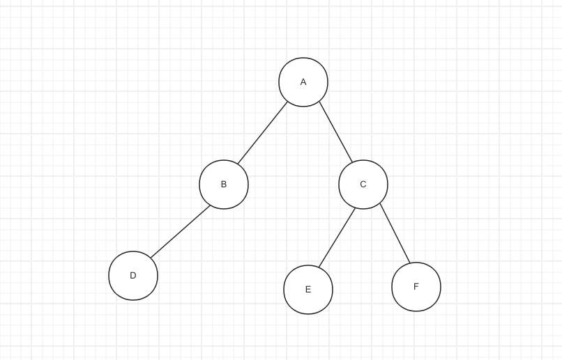

在二叉树的讨论中经常涉及到一些概念。

## 基本概念

1. 节点、根节点、父节点、子节点、兄弟节点、叔节点
   * 节点：所有的圆圈，包含了数据
   * 根节点：A
   * 父节点：A是B的父节点，B是C的父节点
   * 子节点：B是A的子节点，E是C的子节点
   * 兄弟节点：拥有同一个父节点的子节点。B、C互为兄弟节点
   * 叔节点：父节点的兄弟节点。C是D的叔节点

2. 一棵树可以没有任何节点，称为空树
3. 一棵树可以只有一个节点，也就是只有根节点
4. 子树、左子树、右子树
5. 节点的度(degree): 子树的个数，二叉树的度 0,1,2
6. 树的度：所有节点度中最大值
7. 叶子节点：度为0的节点
8. 非叶子节点：度不为0的节点
9. 层数：根节点第1层，根节点的子节点在第2层，以此类推
10. 节点深度: 从根节点到当前节点的唯一路径上的节点总数
11. 节点的高度：从当前节点到最远的叶子节点的路径上的节点总数
12. 树的深度：所有节点深度中的最大值
13. 树的高度：所有节点高度中的最大值
14. 树的深度=树的高度

## 有序树、无序树、森林

1. 有序树：树中任意节点的子节点之间有顺序关系
2. 无序树：树中任意节点之间没有顺序关系
3. 森林：m棵不相交的树的集合
