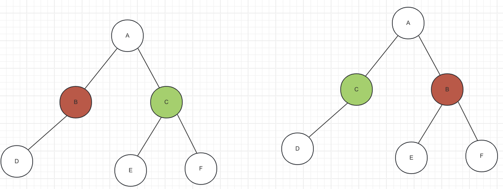

## 1. 二叉树的特点

1. 每个节点的度最大为2 （最多拥有2颗子树)
2. 二叉树是有序数，左子树和右子树是有顺序的

比如下面是2颗二叉树

3. 即使某节点只有一颗子树，也要区分左右子树

## 2. 二叉树的性质

1. 非空二叉树的第i层，最多有2^(i-1)个节点 （i>=1)
2. 高度为h的二叉树最多有2^h-1个节点 （h>=1)
3. ⭐️ 对于任何一颗二叉树，如果叶子节点树为n0, 度为2的节点数为n2, 则有: n0=n2+1

> 证明：
>
> 令：n0=叶子节点树 n1=度为1的节点树 n2=度为2的节点树，n=总节点数
>
> ∴ n=n0 + n1 + n2
>
> 另: ∵ 边数=0×n0 + 1×n1+2×n2=n1 + 2×n2
>
> 又∵只有根节点没有边，即 边数=n-1
>
> ∴ n1+2×n2 =n0 + n1 + n2 -1
>
> ∴ n0 = n2 + 1

## 3. 真二叉树

所有节点的度要么为0，要么为2

## 4. 满二叉树

所有节点的度要么为0，要么为2，且所有叶子节点都在最后一层

> 满二叉树一定是真二叉树， 真二叉树不一定是满二叉树

> 假设满二叉树的高度为h (h>=1), 那么
>
> * 第i层的节点数量： 2^i -1
> * 叶子节点数量：2^(h-1)
> * 总结点数量 n=2^h -1

## 5. 完全二叉树

* 叶子节点只会出现在最后2层（所有节点的高度差<=1)，且最后1层的叶子节点都靠左对齐

> 满二叉树一定是完全二叉树，完全二叉树不一定是满二叉树

* 度为1的节点只有左子树
* 度为1的节点要么只有1个，要么是0个
* 同样节点数量的二叉树，完全二叉树的高度最小 （因为是按层填充的)
* 假设完全二叉树的高度为h (h>=1), 那么
  * 至少有2^(h-1)个节点 (2^(h-2) -1 + 1)
  * 最多有2^h - 1个节点(满二叉树)
* 假如总节点数n
  * h-1<=log2n<h
  * h=floor(log2n)+1
* ⭐️ （用数组来表示完全二叉树)一颗有n个节点的完全二叉树，从上到下、从左到右对节点从0开始编号，对于任意第i个节点
  * 如果i=0, 根节点
  * 如果i>0, 父节点编号为floor ((i-1)/2)
  * 如果2i+1<=n-1, 它的左子节点编号为2i+1
  * 如果2i+1>n-1, 它无左子节点
  * 如果2i+2<=n-1, 它的右子节点编号为2i+2
