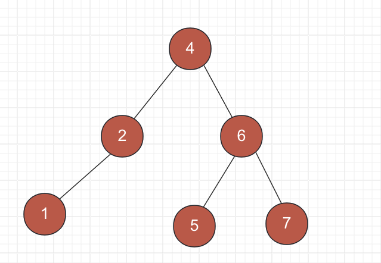
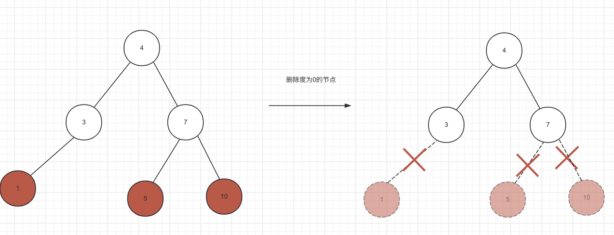
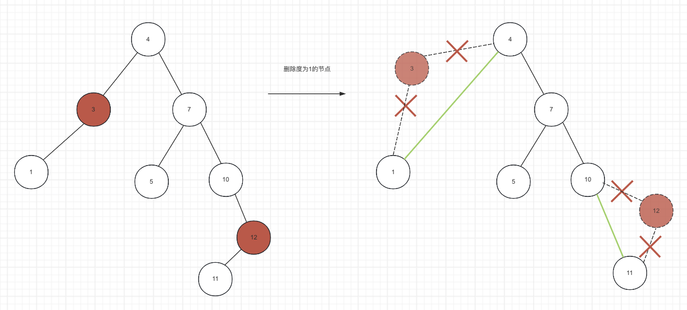
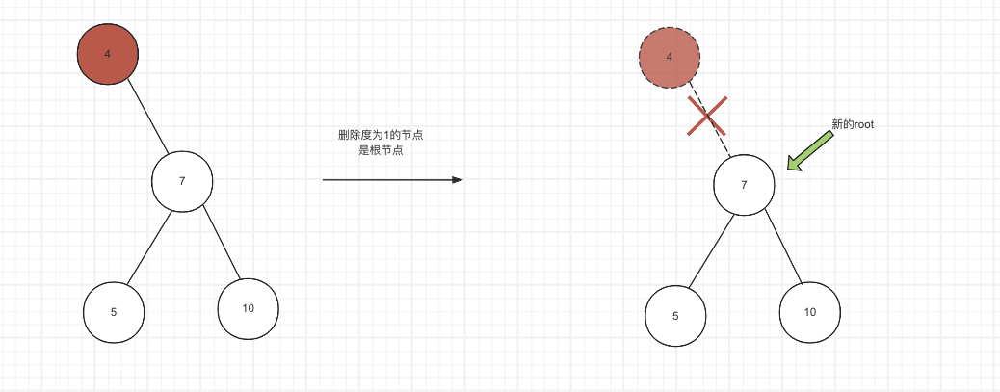
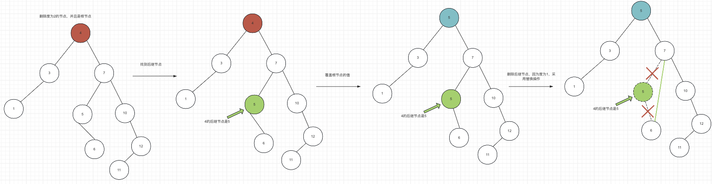
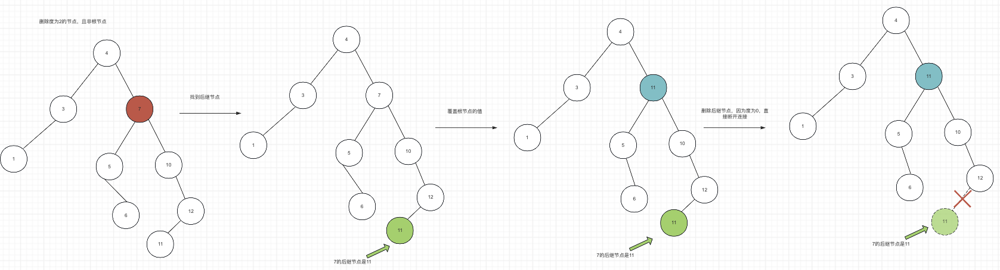

## 基本概念

1. Bianary Search Tree, 简称BST
2. 任意一个节点的值都大于所有左子树的所有节点的值
3. 任意一个节点的值都小于所有右子树的所有节点的值
4. 它的任意左右子树也是一颗二叉搜索树
5. 二叉搜索树存储的元素必须具有可比较性
6. 不允许为null



## 代码实现

### 1.二叉树接口

首先BST是一颗二叉树，所以可以定义二叉树接口,

* 节点Node接口，规定了一个节点需要有left, right, parent属性和访问方法
* 二叉树BinaryTree接口，规定了一颗二叉树需要包含root根节点，还要提供对于某个节点的增删改查的方法

```java
public interface BinaryTree<E> {
    int size();

    boolean isEmpty();

    Node<E> root();

    Node<E> find(E element);

    E add(E element);

    E remove(E element);
  
    public interface Node<E> {
        E element();
        E element(E element);

        Node<E> left();

        Node<E> right();
        Node<E> parent();

        default boolean hasLeft() {
            return left() != null;
        }

        default boolean hasRight() {
            return right() != null;
        }
    }
}

```

### 2. 二叉搜索树实现

定义BinarySearchTree实现BinaryTree接口，定义BinarySearchTree内部类Node实现BinaryTree.Node接口

```java
public  class BinarySearchTree<E extends Comparable<E>> implements BinaryTree<E> {
    protected Node<E> root;
    protected int size;

    public static class Node<E extends Comparable<E>> implements BinaryTree.Node<E> {
        E element;
        Node<E> left,right, parent;
    }
}
```

#### 2.1 size() 和 isEmpty()

因为使用了一个size变量记录元素个数，调用add的时候执行++， 调用remove的时候执行--, 所以size()可以直接返回，isEmpty()就是判断size是否为0

```java
    protected int size;

    @Override
    public int size() {
        return size;
    }

   @Override
    public boolean isEmpty() {
        return size == 0;
    }
```

#### 2.2 find() 根据值查找节点

```java
    @Override
    public Node<E> find(E element) {
        assertNonNull(element, "element");
        Node<E> p = root;
        while (p != null) {
            int cmp = element.compareTo(p.element);
            if (cmp < 0) p = p.left;
            else if (cmp > 0) p = p.right;
            else return p;
        }
        return null;
    }
```

#### 2.3 predecessor() 前驱节点， successor() 后继节点

这两个方法定位私有方法，因为后续删除操作会用到。

所谓前驱或者后继是指二叉树某个节点按中序遍历顺序的前一个节点，或者后一个节点。

> **寻找前驱节点的算法**
>
> 根据BST的性质，中序遍历是升序的，所以前驱就是找第一个比目标节点小的那个节点
>
> * 情况1：目标节点为null, 直接返回null
> * 情况2：目标节点左子树不为空，那前驱节点就是左子树的最右节点
> * 情况3：目标节点左子树为空，那前驱节点就是找第一个比目标节点小的父节点，这又可以分3种情况
>   * 情况3.1: 目标节点的父节点为空，那么目标节点没有前驱节点
>   * 情况3.2: 目标节点是父节点的右子节点，则父节点就是前驱节点
>   * 情况3.3: 目标节点是父亲节点的左子节点，则继续找父亲的父亲，直到遇到情况3.1或者情况3.2
>
> 可以看到情况3稍微复杂，并且是一个迭代的过程，需要2个指针，一个指针指向当前节点，一个指针指向父节点，返回的结果就是父节点，通过这种迭代是可以统一 3.1-3.3这3种情况的编码。

```java
    private Node<E> predecessor(Node<E> node) {
       // 情况1
       if (node == null) return null;
       // 情况2
       if (node.left != null) {
           Node<E> p = node.left;
           while (p.right != null) p = p.right;
           return p;
       }

       // 情况3
        Node<E> p = node;
        while (p.parent != null && p == p.parent.left) {
            p = p.parent;
        }

        return p.parent;
    }
```

> 寻找后继节点的算法
>
> 可以参考寻找前驱节点的算法进行讨论，可以看到寻找的算法是"对称"的，编码也是"对称"的，把right改成left, left改成right

```java
    private Node<E> successor(Node<E> node) {
        if (node == null) return null;
        if (node.right != null) {
            Node<E> p = node.right;
            while (p.left != null) p = p.left;
            return p;
        }

        //往上找
        Node<E> p = node;
        while (p.parent != null && p == p.parent.right) {
            p = p.parent;
        }
        return p.parent;
    }
```

#### 2.4. add()插入操作

> **插入的算法**
>
> 1. 如果根节点为空，直接创建一个新节点，并赋值给root，返回
> 2. 如果根节点不为空，从根节点开始遍历，直到当前节点为空，将当前节点与目标值比较，比较的结果cmp有三种
>    1. cmp < 0, 从当前值的左子树继续遍历
>    2. cmp >0, 从当前值的右子树继续遍历
>    3. cmp=0, 覆盖当前值，退出并返回
>    4. 重复1-3，直到当前节点是叶子节点(左子树和右子树都为空)
> 3. 根据叶子节点和目标值的大小关系，插入叶子节点的左子节点或者右子节点

```java
   @Override
    public E add(E element) {
        if (root == null) {
            root = new Node<>(element, null);
            size = 1;
            return null;
        }
        Node<E> p = root;
        Node<E> parent;
        int cmp;

        do {
            parent = p;
            cmp = element.compareTo(p.element);
            if (cmp < 0) p = p.left;
            else if (cmp > 0) p = p.right;
            else return p.element(element);
        } while (p != null);

        Node<E> newNode = new Node<>(element, parent);
        if (cmp < 0) parent.left = newNode;
        else parent.right = newNode;
        size++;
        return null;
    }
```

#### 2.5 remove()删除操作

删除的操作就比较复杂，需要分情况讨论，讨论的维度是节点的度

> **删除的算法**
>
> 情况1：删除度为0的节点
>
> 度为0，也是叶子节点，直接断开连接即可
>
> 
>
> 情况2：删除度为1的节点，
>
> 拥有1个子节点，就用子节点替换当前节点。这里可以详细讨论下，发现不管是删除的左子节点还是右子节点都是可以直接用子节点替换
>
> 1. 删除的节点父节点是空，也就是要删除根节点，则把根节点的子节点变为根节点
> 2. 删除的节点是父节点的 `左子节点`，则不管被删除节点的子节点是左子结点还是右子节点，都赋值给被删除节点的父节点的 `左子节点`
> 3. 删除的节点是父节点的 `右子节点`，则不管被删除节点的子节点是左子结点还是右子节点，都赋值给被删除节点的父节点的 `右子节点`
>
> 
>
> 
>
> 情况3：删除度为2的节点。
>
> 这里稍稍复杂一点，常用的算法是，
>
> 1. 寻找目标节点的前驱节点或者后继节点，将找到的节点值覆盖当前节点值，然后删除前驱或者后继节点。
> 2. 由于度为2（这个很关键)，所以前驱节点和后继节点一定是度为0或者1的节点，因此删除前驱或者后继节点就转换为情况1或2
>
> 以使用后继节点来删除来举例，比如删除7，其后继节点是11，
>
> 1. 由于 11在7的右子树, 11一定>7的左子树；
> 2. 由于11是7的右子树的最左节点，11是7的右子树的最小值，所以11<7的右子树，
>
> 因此替换后BST的性质保持不变。使用前驱节点删除也可以得到类似的结论。
>
> 
>
> 

代码实现。

注意deleteNode()的方法的小技巧，

1. 先处理度为2的节点，找到后继节点，
2. 用后继节点的值覆盖当前节点，
3. 然后把node指向successor后继节点，
4. 再处理度为0或者1的情况。

往往我们分析的时候是自上而下，从一般到特殊，而实现的时候是自下而上，从特殊到一般。

```java
    @Override
    public E remove(E element) {
        Node<E> p = find(element);
        if (p == null) {
            return null;
        }

        E oldValue = p.element;
        deleteNode(p);
        return oldValue;
    }

    private void deleteNode(Node<E> node) {
        size--;
        // 度为2
        if (node.degree() == 2) {
            Node<E> s = successor(node);
            node.element = s.element;
            node = s;
        }

        // node的度一定是0或者1
        Node<E> replacement = node.left != null ? node.left : node.right;
        // 度为1
        if (replacement != null) {
            replacement.parent = node.parent;
            if (node.parent == null) {
                root = replacement;
            } else if (node == node.parent.left) {
                node.parent.left = replacement;
            } else {
                node.parent.right = replacement;
            }
            // node断开连接
            node.left = node.right = node.parent = null;
        }
        // 度为0, node是叶子节点
        else {
            if (node.parent == null) {
                root = null;
            } else if (node == node.parent.left) {
                node.parent.left = null;
            }  else {
                node.parent.right = null;
            }
            node.parent = null;
        }

    }

```

测试代码和结果：

```java
public class TestBSTRemove {

    public static void main(String[] args) {
        int[] data = new int[]{7, 4, 9, 2, 5, 8, 11, 3, 12, 21, 1};
        BinarySearchTree<Integer> bst = new BinarySearchTree<>();
        for (int i=0; i<data.length; i++) {
            bst.add(data[i]);
        }
        System.out.println("============== 初始化BST =================");
        BinaryTrees.println(BinaryTrees.wrap(bst));

        Scanner sc = new Scanner(System.in);
        while (!bst.isEmpty()) {
            System.out.print("输入要删除的元素: ");
            int toDel = Integer.parseInt(sc.nextLine());
            bst.remove(toDel);
            System.out.println("============= 删除后 =================");
            BinaryTrees.println(BinaryTrees.wrap(bst));
        }

        System.out.println("FINISH!");
    }
}
```

输出

```java


============== 初始化BST =================
    ┌──7──┐
    │     │
  ┌─4─┐ ┌─9─┐
  │   │ │   │
┌─2─┐ 5 8   11─┐
│   │          │
1   3          12─┐
                  │
                  21
输入要删除的元素: 1
============= 删除后 =================
  ┌──7──┐
  │     │
┌─4─┐ ┌─9─┐
│   │ │   │
2─┐ 5 8   11─┐
  │          │
  3          12─┐
                │
                21
输入要删除的元素: 21
============= 删除后 =================
  ┌──7──┐
  │     │
┌─4─┐ ┌─9─┐
│   │ │   │
2─┐ 5 8   11─┐
  │          │
  3          12
输入要删除的元素: 11
============= 删除后 =================
  ┌──7──┐
  │     │
┌─4─┐ ┌─9─┐
│   │ │   │
2─┐ 5 8   12
  │
  3
输入要删除的元素: 2
============= 删除后 =================
  ┌──7──┐
  │     │
┌─4─┐ ┌─9─┐
│   │ │   │
3   5 8   12
输入要删除的元素: 4
============= 删除后 =================
  ┌─7─┐
  │   │
┌─5 ┌─9─┐
│   │   │
3   8   12
输入要删除的元素: 7
============= 删除后 =================
  ┌─8─┐
  │   │
┌─5   9─┐
│       │
3       12
输入要删除的元素: 8
============= 删除后 =================
  ┌─9─┐
  │   │
┌─5   12
│
3
输入要删除的元素: 5
============= 删除后 =================
┌─9─┐
│   │
3   12
输入要删除的元素: 9
============= 删除后 =================
┌─12
│
3
输入要删除的元素: 12
============= 删除后 =================
3
输入要删除的元素: 11
============= 删除后 =================
3
输入要删除的元素: 3
============= 删除后 =================
FINISH!

Process finished with exit code 0

```

## 3. BST操作复杂度分析

1. size() : O(1)
2. isEmpty(): O(1)
3. find(): 由于BST的性质本质就是二分法，最差时间复杂度是O(n) (退化成链表)， 平均时间复杂度是O(logn)
4. add(): 先要找到可以插入的叶子节点位置，也就是find()方法的平均时间复杂度，也是O(logn), 然后执行添加元素操作，这是O(1), 因此总的平均时间复杂度是O(logn)
5. predecessor(), successor(): 最坏时间复杂度是O(n) (退化为链表)，平均时间复杂度是O(logn)
6. remove(): 最坏的情况是处理度为2，先要找到前驱/后继节点，平均复杂度是O(logn)，值覆盖和删除度为0或者1的操作都是简单的指针操作，复杂度O(1), 因此总的平均时间复杂度是O(logn)

## 4. 总结

BST是学习AVL树和红黑树的基础，自平衡树的添加和删除操作也只是在BST添加和删除操作上加上了rebalance的操作。因此必须好好理解BST。

1. BST的概念：首先是一颗二叉树，然后任意节点的左子树小于根节点，右子树大于根节点，左右子树分别也是BST
2. 代码实现：首先定义了二叉树的接口和节点接口，定义了一颗二叉树应该有的通用操作。BST的实现类实现了这2个接口，这里重点总结下add和remove操作
   1. add操作分了2种情况讨论
      * 情况1：根节点为空，直接创建新节点
      * 情况2: 根节点非空，从根节点开始遍历到叶子节点，插入即可
   2. remove操作比较复杂，根据要删除节点度的不同，分了3种情况讨论
      * 情况1：删除度为0的节点。也就是叶子节点，将父节点的子节点置为null。
      * 情况2：删除度为1的节点。使用子节点替换自己。实现的时候也要注意当前节点是根节点的情况，防止空指针异常
      * 情况3：删除度为2的节点。删除操作可以转化 `替换+删除`。由于BST的性质，替换的节点只能是前驱节点或者后继节点，又由于度为2，因此前驱和后继节点的度一定为1或者0。因此可以先用前驱或者后继节点的值替换当前节点的值，然后删除前驱和后继节点就转化为情况1和情况2.
      * 注意以上3种情况在实现的时候，注意既是叶子节点是根节点的情况，防止空指针异常。
3. BST操作复杂度分析

| 操作          | 最差时间复杂度 | 平均时间复杂度 |
| ------------- | -------------- | -------------- |
| size()        | O(1)           | O(1)           |
| isEmpty()     | O(1)           | O(1)           |
| find()        | O(n)           | O(logn)        |
| predecessor() | O(n)           | O(logn)        |
| successor()   | O(n)           | O(logn)        |
| add           | O(n)           | O(logn)        |
| remove        | O(n)           | O(logn)        |
