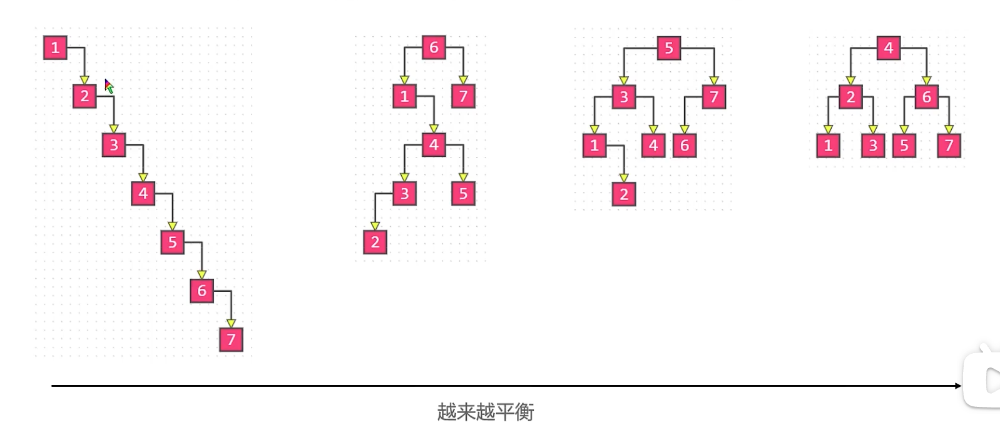

## 平衡的概念

当节点数量固定时，左右子树的高度越接近，这颗二叉树就越平衡，同时整棵树的高度就越低

> 二叉搜索树为什么需要平衡？
>
> 对于一颗BST，无论是添加还是删除一个节点，都必须先进行查询，查询到之后进行的操作都是O(1)的，所以这些操作的时间复杂度主要取决于查询的时间复杂度，对于一颗高度为h的BST, 平均时间复杂度是O(h), 因此我们的目标是尽量通过调整节点的相对位置来减小h，其实也就是尽量使得BST趋于平衡

## 性能和平衡的权衡

任何一颗BST都可以调整成一颗完全二叉树，此时树的高度是最低的，查询的性能也是最好的。

然而，天下没有免费的午餐，调整BST趋于平衡也是有一定的开销的，每次插入或者删除一个元素如果都要调整BST为一颗完全二叉树带来的开销可能远远超过操作本身的开销。因此我们的目标是“用尽量少的调整次数使得BST达到适度平衡"

> 怎么去衡量 `适度` 呢？有没有定量的方式？
>
> 比如，对于一颗BST，我们定义任意一个节点的左右子树的高度差，通过这个高度差来衡量这个节点为根节点的BST的 `平衡程度` 这个平衡程度也有个名字，叫 `平衡因子`

## 常见的平衡BST

1. AVL树
2. 红黑树

这两种也称为自平衡的BST，就是在添加、搜索操作后可以自动调整为平衡状态。
