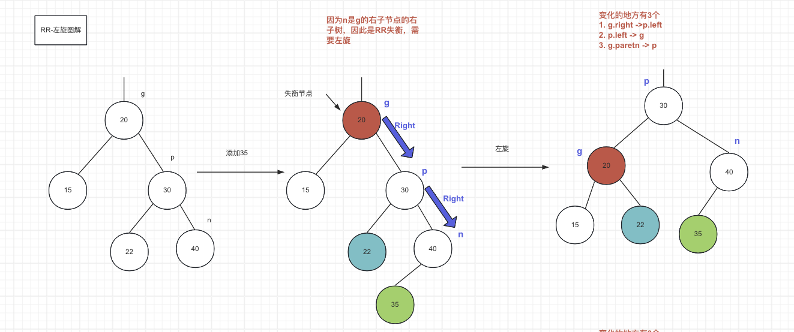
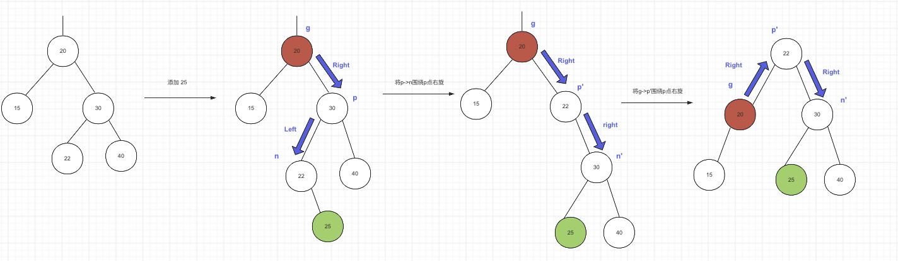
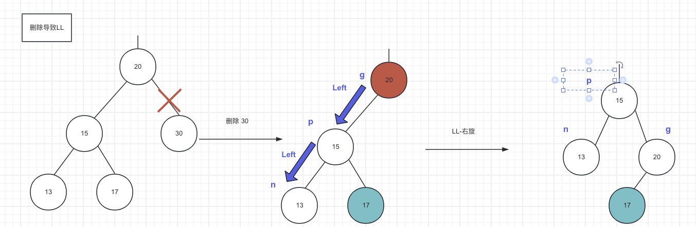
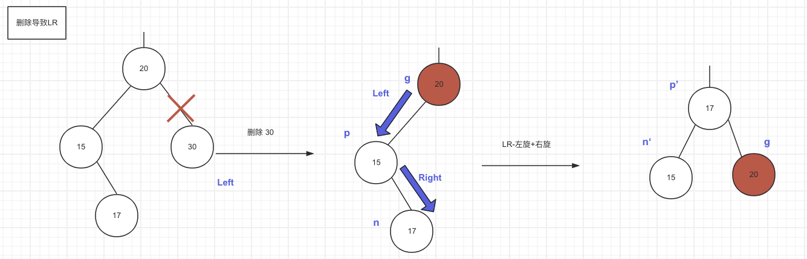
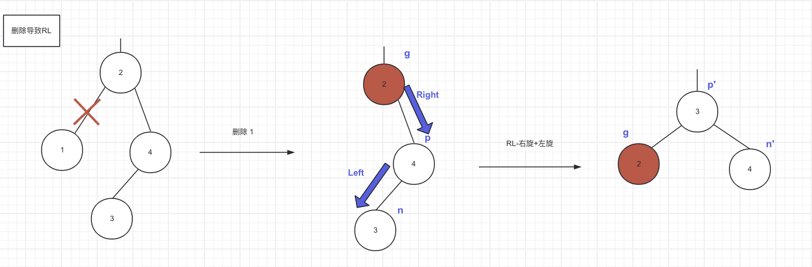

## 基本概念

1. 每个节点平衡因子只可能是-1,0,1, 如果平衡因子的绝对值超过1，就称之为 `失衡`
2. 搜索、添加、删除的时间复杂度是O(logn)


3. AVL树可以看做是BST+自平衡操作

## 查询操作

因为自平衡的存在，AVL树的左右子树高度差始终是-1,0,1, 因此查询的时间复杂度就等于树的高度, 也就是log(n), n是节点个数，这是相较于普通BST的优势。

## 添加导致的失衡（分析)

> 如果添加导致了失衡，会影响哪些节点？哪些

* 失衡的是所有祖先节点（除了父节点)
* 不会失衡的是父节点以及非祖先节点

> 如何解决
>
> 找到失衡的节点，进行旋转操作。

定义3个关键节点

* n: 新元素的父节点，元素插入的节点
* p: n的父节点
* g: p的父节点，也就是n的祖父节点

### 情况1: LL-右旋转

从g->p是向左，p->n是向左，这种失衡称为LL, 解决的办法是把g->p形成的向量围绕着g顺时针旋转

> LL-右旋转需要做的变化, ->表示要指向的节点:
>
> * g.left -> p.right
> * p.right -> g
> * g.parent -> p
> * p.right.parent -> g
> * 更新g, p的高度，先更新g, 然后更新p，因为此时g是p的子节点


### 情况2：RR-左旋转

如果从g到n的方向是 `Right-Right`,就成为 `RR`失衡, 解决的办法是g->p形成的向量围绕着g逆时针旋转。

> RR-左旋转需要做的变化
>
> * g.right -> p.left;
> * p.left -> g
> * g.parent -> p
> * p.left.parent -> g
> * 更新g,p的高度，先更新g, 再更新p



### 情况3: LR-双旋转

先左旋变成LL，再右旋


### 情况4：LR-双旋转

先右旋变成RR, 再左旋



## 添加导致的失衡（代码实现)

写代码之前，我们先思考一下，AVL树失衡与再平衡的细节问题。

* AVL树是一棵BST
* AVL树的添加操作可以复用BST的算法逻辑，也就是说一定是添加到叶子节点的后面
* AVL树在添加一个节点会导致哪些节点失衡？
  * 父节点会失衡吗？不会，因为父节点要么度为0，要么度为1，加了一个节点左右子树的高度差仍然<=1
  * 祖父节点会失衡吗？有可能，分三种情况讨论
    * 如果祖父节点平衡因子是0，那么添加之后会变成1或者-1，仍然平衡;
    * 如果祖父节点平衡因子是-1，那么添加之后会变成-2, 失衡
    * 如果组父节点平衡因子是1，那么添加之后会变成2， 失衡
  * 祖父节点的父节点以及祖父节点会失衡吗？
    * 如果祖父节点不失衡，那么其父节点和祖父节点一定不会失衡，因为新添加的节点并没有引起祖父节点这颗子树高度的变化。
    * 如果祖父节点失衡，那么其父节点和祖父节点一定会失衡，因为以祖父节点为根节点的这课子树的高度发生了变化
  * 兄弟节点，父节点的兄弟节点会失衡吗? 显然不会，因为并未引起他们子树高度的变化
* AVL树在调整平衡后，需要迭代或者递归的去调整父节点的平衡吗？答案是不需要
  * 假设我们找到了第一个失衡的节点，经过调整这颗子树的高度会比调整前减少1，而调整前的高度是多了1，因此这颗子树的高度实际上是恢复到调整前的，因此调整前后失衡节点的所有父节点的平衡因子保持不变。

一句话总结下:

新增一个节点，要么不会使得整棵树失衡，要么只会导致祖父节点及其所有父节点失衡，而且只需要调整以第一个失衡的祖宗节点为根节点的子树，就可以使整棵树重新平衡

为了方便计算平衡因子，我们在BST节点的基础上引入height高度属性，添加之后迭代更新父节点高度，算法如下，

* BST算法添加一个节点
* 迭代其父节点，重新计算父节点的高度，迭代的终止条件是父节点为空，也就是到了根节点
* 计算完之后判断一下父节点是否仍然平衡
  * 如果平衡，继续迭代
  * 如果不平衡，调整以不平衡节点为根节点的子树，退出迭代

### 扩展BST的添加方法

考虑到AVL树和BST的关系是 `is-a`, 可以使用继承,

* AVLTree继承BST
* AVLNode继承BST.Node

注意AVLNode.height初始值为1，因为在再平衡方法中是从新节点的父节点开始迭代计算高度，因此这个初始值相当于迭代的初始条件，添加的时候就可以知道一定是1

```java
public class AVLTree<E extends Comparable<E>> extends BinarySearchTree<E> {
    public static class AVLNode<E extends Comparable<E>> extends BinarySearchTree.Node<E> {
        int height = 1;
    }
}
```

### 再平衡方法的框架

在BST的add方法中增加调整的方法fixAfterInsertion, 由子类AVL去实现

```java
    @Override
    public E add(E element) {
        if (root == null) {
            root = createNode(element, null);
            size = 1;
            // 增加元素后调整
            fixAfterInsertion(root);
            return null;
        }
        Node<E> p = root;
        Node<E> parent;
        int cmp;

        do {
            parent = p;
            cmp = element.compareTo(p.element);
            if (cmp < 0) p = p.left;
            else if (cmp > 0) p = p.right;
            else return p.element(element);
        } while (p != null);

        Node<E> newNode = createNode(element, parent);
        if (cmp < 0) parent.left = newNode;
        else parent.right = newNode;
        size++;
        // 增加元素后调整
        fixAfterInsertion(newNode);
        return null;
    }
```

fixAfterInsertion方法

```java
    @Override
    protected void fixAfterInsertion(BinarySearchTree.Node<E> node) {
        // node是新插入的节点，因为是BST，node一定是叶子节点
        // 所以第一次node=node.parent, node指向了n，第二次指向了p，第三次指向了g...
        while ((node = node.parent) != null) {
	    // 迭代地自底向上更新高度
            updateHeight(node);
  
            // 所以node的子节点的高度已经是最新的了，
            if (!isBalanced(node)){
                // 再平衡
                reBalance(node);
                // 父节点一定是平衡了，不需要重新计算高度
                break;
            }
        }
    }

    private boolean isBalanced(Node<E> node) {
        if (node == null) return true;
        return Math.abs(((AVLNode<E>) node).balanceFactor()) <= 1;
    }
```

### 更新节点高度的方法

```java
        public void updateHeight() {
            int leftHeight = left == null ? 0 : ((AVLNode<E>) left).height;
            int rightHeight = right == null ? 0 : ((AVLNode<E>) right).height;
            this.height = 1 + Math.max(leftHeight, rightHeight);
        }
```

### 平衡因子的计算方法

更新完高度，就可以去计算平衡因子了， 也就是左子树高度-右子树高度

```java
        public int balanceFactor() {
            int leftHeight = left == null ? 0 : ((AVLNode<E>) left).height;
            int rightHeight = right == null ? 0 : ((AVLNode<E>) right).height;
            return leftHeight - rightHeight;
        }


```

### ⭐️ (核心)再平衡方法

需要注意几个点

* 代码中的n, p, g是参考了前面的分析，n是新增节点的父节点，p是n的父节点，g是p的父节点
* 在迭代过程中，我们可以直接得到g, p其实就是p的height较高的子节点，同理，n也是p的高度较高的子节点
* 有了n, p, g 可以很方便的判断是LL，RR，LR，RL中的哪种情况，根据对应的情况调用左旋，右旋方法
* 左旋右旋方法中做完了需要
  * 先更新p,g的左右指针
  * 更新所有变化节点的parent
  * 更新p,g高度，因为旋转会改变p, g的左右子树。注意先更新调整后较低的g节点，再更新p节点

```java
    private void reBalance(Node<E> node) {
        // 找到n, p, g
        AVLNode<E> g = (AVLNode<E>) node;
        AVLNode<E> p = g.tallerChild();
        AVLNode<E> n = p.tallerChild();
        // LL-右旋转
        if (p.isLeftChild() && n.isLeftChild()) {
            rotateRight(g);
            return;
        }

        // LR-左旋转+右旋转
        if (p.isLeftChild() && n.isRightChild()) {
            rotateLeft(p);
            rotateRight(g);
            return;
        }

        // RR-左旋转
        if (p.isRightChild() && n.isRightChild()) {
            rotateLeft(g);
            return;
        }

        // RL-右旋转+左旋转
        rotateRight(p);
        rotateLeft(g);
    }

    /**
     * |                  |
     *  g                 p
     * /   \             / \
     * p    y   =>      n   g
     * / \                 /  \
     * n pRight      pRight    y
     *
     * @param node
     */
    private void rotateRight(AVLNode<E> node) {
        // 带入p,g,pRight
        final AVLNode<E> g = node;
        final AVLNode<E> p = (AVLNode<E>) g.left;
        final AVLNode<E> pRight = (AVLNode<E>) p.right;

        // 1. 更新左右
        g.left = pRight;
        p.right = g;

        // 2.更新parent
        // 2.1 更新p的parent
        p.parent = g.parent;
        if (g.isLeftChild()) {
            g.parent.left = p;
        } else if(g.isRightChild()) {
            g.parent.right = p;
        } else {
            root = p;
        }
        // 2.2 更新pRight的parent
        if (pRight != null) {
            pRight.parent = g;
        }
        // 2.3 更新g的parent
        g.parent = p;

        // 3. 更新高度，先g后p
        updateHeight(g);
        updateHeight(p);
    }


    private void rotateLeft(AVLNode<E> node) {
        // 带入p, g, pLeft
        final AVLNode<E> g = node;
        final AVLNode<E> p = (AVLNode<E>) g.right;
        final AVLNode<E> pLeft = (AVLNode<E>) p.left;
        // 1. 更新左右节点
        g.right = pLeft;
        p.left = g;

        // 2. 更新parent
        // 2.1 让p称为根节点
        p.parent = g.parent;
        if (g.isLeftChild()) {
            g.parent.left = p;
        } else if (g.isRightChild()) {
            g.parent.right = p;
        }
        else {
            root = p;
        }

        // 2.2 让pLeft.parent指向g, 注意pLeft可能为空
        if (pLeft != null) {
            pLeft.parent = g;
        }

        // 2.3 让g.parent指向p
        g.parent = p;

        // 更新高度, 先更新g, 再更新p
        updateHeight(g);
        updateHeight(p);
    }
```

## 删除导致的失衡 （分析)

类似添加，删除导致的失衡，也有LL， RR， LR， RL四种情况

### 情况1：LL



### 情况2：RR


### 情况3：LR



### 情况4：RL



> 问题1： 先思考一下，删除一个节点会导致哪些节点失去平衡?

1. 父节点和祖先节点

删除一个节点相当于父节点的平衡因子+1或者-1，

* 如果父节点平衡因子是0，那无论+-1都不会引起父节点失衡，并且由于父节点的高度也没有变化，那父节点的祖先节点也不会失衡
* 如果父节点平衡因子是1，也就是左子树=右子树高度+1，
  * 如果删除的是右子树的节点，平衡因子变成2，失衡， 但父节点高度不会变化，仍然等于左子树高度，因此父节点的所有祖宗都不会失衡
  * 如果删除的是左子树，平衡因子变成0，不失衡，但是父节点的高度会减少1，如果父节点是祖父节点中较短的子树，那么祖父节点也会失衡，但是祖父节点的高度不会变，因此祖父节点的祖宗节点不会失衡

2. 兄弟节点和叔节点

很明显，由于并没有改变兄弟节点或者叔叔节点的高度，因此也不会导致他们失衡

因此可以得到结论，

* 删除一个节点不一定导致树的失衡，
* 一旦失衡，只可能引起一个节点失衡，因为失衡的节点一定是其父节点较低的子树，所以父节点的高度不变不会失衡。

问题2：如果失衡，需要调整几次

由于调整平衡相当于这颗子树的高度-1，那么就会导致父节点可能会失衡，因此还要调整父节点，父节点调整完高度又-1，如果父节点是祖父节点较低的子树，那么就不需要调整，但如果父节点是祖父较高的

子树，则又要调整祖父节点，依次类推。每一层都要调整，因此最多需要调整log(n)次。

对比一下添加和删除操作

* 添加1个元素会导致祖父节点及其所有祖宗节点失衡，但调整只需要1-2次 （单旋or双旋)
* 删除1个元素只会导致一个祖宗节点失衡，但最多需要调整log(n)次

## 删除导致的失衡（代码实现)

代码很简单，思路也是类似添加调整算法的迭代+调整，只有一个地方不同，删除的调整操作需要从下到上一直迭代到根节点

### 扩展BST的删除方法

因为AVL树继承了BST树，可以服用deleteNode逻辑，并在父节点与被删除节点断开连接后增加fixAfterRemoval方法，重点关注这个方法的位置

```java
    private void deleteNode(Node<E> node) {
        size--;
        // 度为2
        if (node.degree() == 2) {
            Node<E> s = successor(node);
            node.element = s.element;
            node = s;
        }

        // node的度一定是0或者1
        Node<E> replacement = node.left != null ? node.left : node.right;
        // 度为1
        if (replacement != null) {
            replacement.parent = node.parent;
            if (node.parent == null) {
                root = replacement;
            } else if (node == node.parent.left) {
                node.parent.left = replacement;
            } else {
                node.parent.right = replacement;
            }
            // node断开连接
            node.left = node.right = node.parent = null;

            // 从replacement开始修复
            fixAfterRemoval(replacement);
        }
        // 度为0, node是叶子节点
        else {
            if (node.parent == null) {
                root = null;
                // 不需要修复
            } else if (node == node.parent.left) {
                node.parent.left = null;
            }  else {
                node.parent.right = null;
            }
            // 删除的叶子节点，由于父节点已经断开了与node的连接, 所以修复node节点即可
            fixAfterRemoval(node);
            node.parent = null;
        }

    }
```

### ⭐️ (核心)再平衡方法

```java


 @Override
    protected void fixAfterRemoval(Node<E> node) {
        // 首先要注意传入的node不可能为空
        // 其次，删除某个节点只会影响父节点的平衡，所以迭代去修复父节点即可
        while ((node = node.parent) != null) {
            // 重新计算高度
            if (isBalanced(node)) {
                updateHeight(node);
            } else {
                reBalance(node);
                // 因为再平衡会导致父节点左右子树的高度发生变化，所以需要继续递归
            }
        }
    }
```

## AVL树操作的复杂度分析

* size(), isEmpty(): O(1)
* find(): 由于自平衡的功能，AVL的最差、最好、平均时间复杂度都是O(logn), 这是与普通BST相比的优势
* add()：查询的时间复杂度O(logn), 调整是固定的1次或2次，也就是O(1), 因此整体的复杂度是O(logn)
* remove(): 查询的时间复杂度O(logn), 调整的复杂度最好O(1)，最差调整O(logn), 平均是O(logn), 因此整体的复杂度也是O(logn)

## 总结

1. AVL树可以看做是BST+添加删除后的自平衡
2. AVL的查询操作能稳定在O(logn)的复杂度，这是相比与普通BST的优势
3. 再平衡的算法包括LL-右旋，RR-左旋，LR-左旋+右旋，RL-右旋+左旋
4. 复杂度

| 操作     | 最坏时间复杂度 | 最好时间复杂度 | 平均时间复杂度 |
| -------- | -------------- | -------------- | -------------- |
| size()   | O(1)           | O(1)           | O(1)           |
| find()   | O(logn)        | O(logn)        | O(logn)        |
| add()    | O(logn)        | O(logn)        | O(logn)        |
| remove() | O(logn)        | O(logn)        | O(logn)        |
