## 为什么要学B树

为了更好的理解红黑树。

在讨论红黑树之前，先引入B-树，因为红黑树和4阶B树是等价的，而4阶B树比红黑树好理解，所以先学B树

## 什么是B树

一个节点可以有>=2个key(元素)，一个节点可以有>=2个

## 什么是m阶B树

m表示一个节点最多有m个子节点, 对于B树来说m>=3

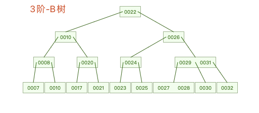

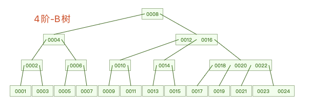

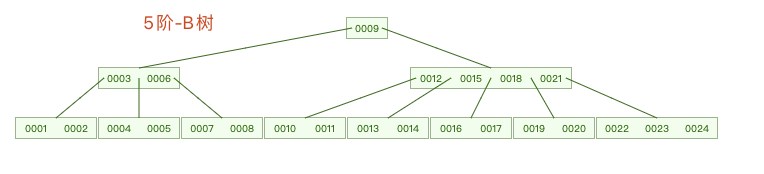

## B树的性质

从图中可以观察到m阶B树的规律

1. 根节点：有1~m-1个元素，如果根节点不是叶子节点， 2-m个子节点
2. 非根节点：最少 $\lceil \frac m2 \rceil$-1  个元素, 最多m-1个元素，$\lceil \frac m2 \rceil$ ~m个子节点
3. 所有的叶子节点都在同一层

比如

* 3阶B树：根节点1-2个元素，2-3个子节点，非根节点 1-2个元素，2-3个子节点
* 4阶B树：根节点1-3个元素，2-4个子节点，非根节点1-3个元素，2-4个子节点
* 5阶B树：根节点1-4个元素，2-5个子节点，非根节点2-4个元素，3-5个子节点
* ...

## m=2的情况

1. 根节点：有且只有1个元素，如果不是叶子节点，则有且只有2个子节点
2. 非根节点：有0-1个元素，1-2个子节点
3. 有类似BST的性质

这不就是BST吗，并且是真二叉树（0个或2个子节点，没有1个节点这种中间情况), 所以2阶B树就是BST且是真二叉树。

但是我们讨论B树的时候至少都是3阶的，例如数据库大概是200-300阶的B树

## 2-3树，2-3-4树是什么

* 2-3树就是3阶B树，2-3的意思就是非根节点可以有2个或者3个子节点
* 2-3-4树就是4阶B树，2-3-4的意思就是非根节点可以有2个、3个或者4个节点

2-3树是左倾红黑树的等价，比如《Algorithms》这本经典教材里就是先介绍2-3树，再引入红黑树的添加操作，并且规定红色箭头是左倾(left-leaned)的。接着再介绍红黑树的删除操作时又先引入了2-3-4树。

2-3-4树和红黑树如何等价变换的问题在下一篇《红黑树》中介绍。

## B树的查找操作

例如我们要找13

* 从根节点开始查找
* 13 > 8, 往最右子树找
* 13 > 12, 13<16, 从12-16中间的子树找
* 13<14, 从14的最左子树找
* 13=13， 命中

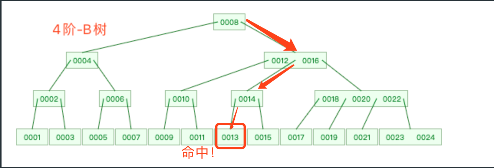

## B树的添加和上溢分裂

假设有一棵m阶B树，

* 首先和BST类似，添加元素都是从叶子节点开始添加，因为叶子节点一定是包含了整颗树的最小值(最左)和最大值（最右)，因此一定能找到一个节点让新元素加入
* 当添加一个元素后，该节点的个数超过m-1个，也就是m个，超过了m阶的限制， 也就是发生了 `上溢`，此时做如下 `分裂`操作
  * 从0开始编号则有下标0,1,2,m-1,
  * 取中间元素 为（m-1)/2，的元素，比如4阶，就取下标为1的元素，进入到父节点
  * 将下标0~(m-1)/2的元素作为中间元素的左子节点, (m-1)/2+1 ~ m-1的元素作为新元素的右子节点
  * 如果父节点的个数也达到了m，继续分裂直到根节点

可以看到上溢会向上传播到根节点，上溢会使B树长高

举个🌰:

一棵3阶B树如下，添加7

* 5-6-7，3个节点，上溢，把6提上去，5， 7分别作为6的左右子节点
* 2-4-6，3个节点，上溢，把4提上去，2，6分别作为4的左右子节点

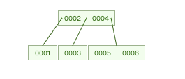=添加7=>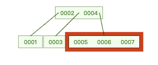=分裂=>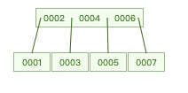=分裂=>

## B树的删除和下溢合并

假设有一棵m阶的B树，需要删除一个节点，类似BST，我们也分情况讨论

* 情况1：删除的是叶子节点，直接删除，删除之后根据B树的性质进行调整
* 情况2：删除的是非叶子节点，找到前驱或者后继节点，替换，再删除前驱或者后继节点，由于B树的性质，前驱和后继节点一定是叶子节点，所以删除非叶子节点转化成了情况1

删除后调整算法：

* 情况1： 删除后当前节点数量>=$\lceil \frac m2\rceil-1$, 不需要调整
* 情况2：删除后当前节点数量变为$\lceil \frac m2\rceil -2$, 称为 `下溢`。
  * 情况2.1： 兄弟节点（左右都可以)的数量>=$\lceil \frac m2 \rceil$, 则从兄弟节点借一个元素添加到父节点的最左边，从父节点借一个元素到当前节点。此时由于父节点，兄弟节点的元素数量不变，仍然符合m阶B树的定义，而当前节点也有了 $\lceil \frac m2\rceil-1$ 个元素，因此调整完成
    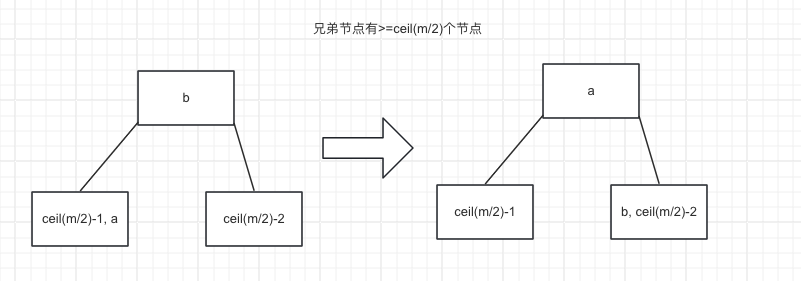
  * 情况2.2： 兄弟节点（左右都可以)的数量为$\lceil \frac m2 \rceil -1$ 个元素， 则无法从兄弟节点借元素，此时从父节点中抽取当前节点和兄弟节点的中间的元素下来，与当前元素和兄弟节点合并成新的节点, 新节点的元素个数一定是 $\lceil \frac m2 \rceil -1$ 个， 一定是符合要求的，但是父节点可能变成 $\lceil \frac m2 \rceil -2$, 需要继续从兄弟节点或者父节点借元素，也就是重复情况2.1，情况2.2的算法，直到根节点。
    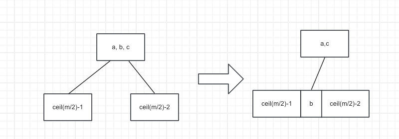

举个🌰

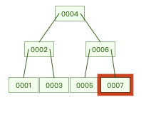=删除7=>=从父节点借6=>=从父节点借4=>

=删除3=>=从兄弟节点借5=>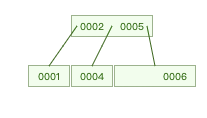=完成=>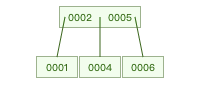

可以看到，下溢是会向上传播到根节点，使B树降低层数

## 总结

1. 简单介绍了什么是B树，什么是B树的阶，B树的阶>=3
2. B树性质
   1. 如果是根节点，则至少有1个元素，至多m-1个元素，如果根节点不是叶子节点，则至少有2个子节点，至多有m个子节点
   2. 如果是非根节点，则至少有$\lceil \frac m2 \rceil -1$个元素，至多有m-1个元素，至少有$\lceil \frac m2 \rceil$个子节点，至多有m个子节点
   3. 所有叶子节点都在同一层
3. 2-3树就是3阶B树，2-3-4树就是4阶B树
4. B树的添加总是添加到叶子节点，可能会产生上溢，即元素数量达到m, 此时会产生分裂，将中间节点上提到父节点，如果父节点上溢，继续上提中间节点并分裂，上溢是会向上传播到根节点的
5. B树的删除可以转化为删除叶子节点，可能会产生下溢，即元素数量达到$\lceil \frac m2 \rceil-2$, 此时分2种情况调整
   1. 兄弟节点数量足够，则从兄弟节点借一个元素到父节点，父节点借一个元素到当前节点，满足要求
   2. 兄弟节点数量不够，则从父节点借一个元素与当前节点以及兄弟节点合并成新的节点
   3. 合并操作可能会导致父节点下溢，则父节点继续借元素，合并，直到传播到根节点
