## 什么是红黑树

首先，红黑树是一棵二叉搜索树BST, 其次红黑树是一棵自平衡树。它为了保持自平衡，在每次添加或者删除操作后都需要满足以下几条性质

1. 所有的节点不是黑色就是红色
2. 根节点是黑色
3. 叶子节点是null，并且是黑色
4. 红色节点的子节点必须是黑色，等价的说法是不能有2个红色节点相连，或者不能有2个连续的红色节点，或者红色节点的叶子节点只能是黑色
5. 红黑树是黑色平衡的，等价的说法是从根节点出发到叶子节点的所有路径的黑色节点个数都是相等的

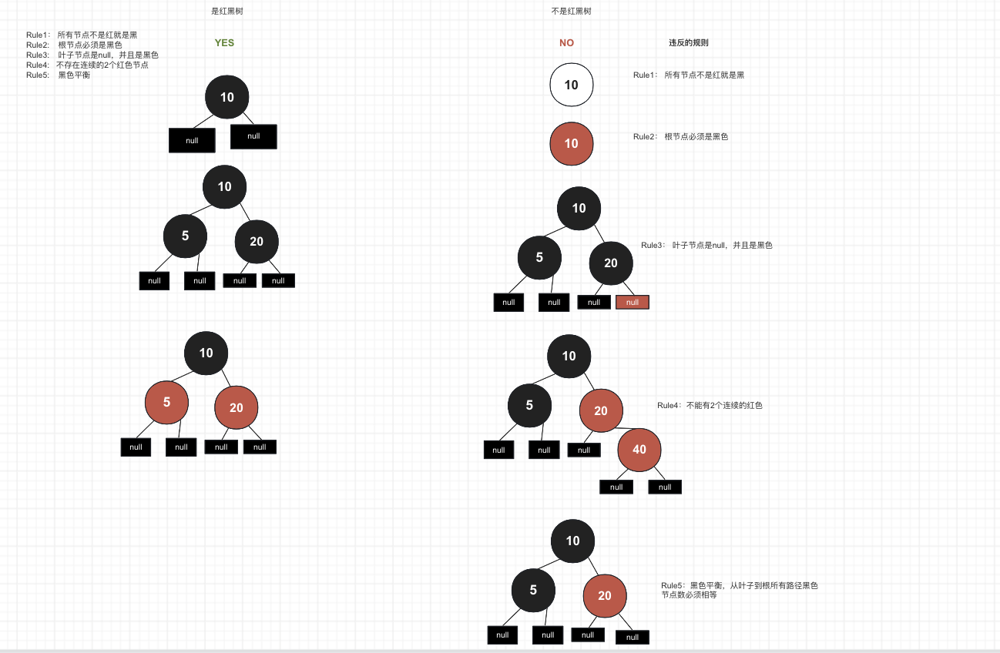

第一次接触红黑树都会一脸懵逼，主要的问题在于，无法理解这五条性质是怎么来的？为什么这5条性质满足了红黑树就能自平衡了呢？

这需要先去了解红黑树的本质--- 4阶B树

## 4阶B树转化为红黑树

先来一颗4阶B树，或者叫2-3-4树

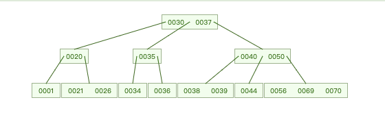

把这棵4阶B树做如下变性操作

1. 如果一个节点只有一个元素，不做处理
2. 如果一个节点有2个元素，使用向左的红色箭头连接2个元素
3. 如果一个节点有3个元素，中间的元素使用2个红色箭头连接2个元素，箭头方向朝外
4. 所有的元素变成独立的节点
5. 为了方便表示，我们把红色箭头信息保存在节点中，即：被红色箭头指向的节点涂成红色
6. 为了迎合红黑树的定义，我们把其它节点涂成黑色。
7. 为了方便观察，我们【格式化】一下，按照二叉树的一般画法重新画这棵树，就得到了一颗红黑树

仔细观察这棵红黑树，红黑树的5条性质都是满足的

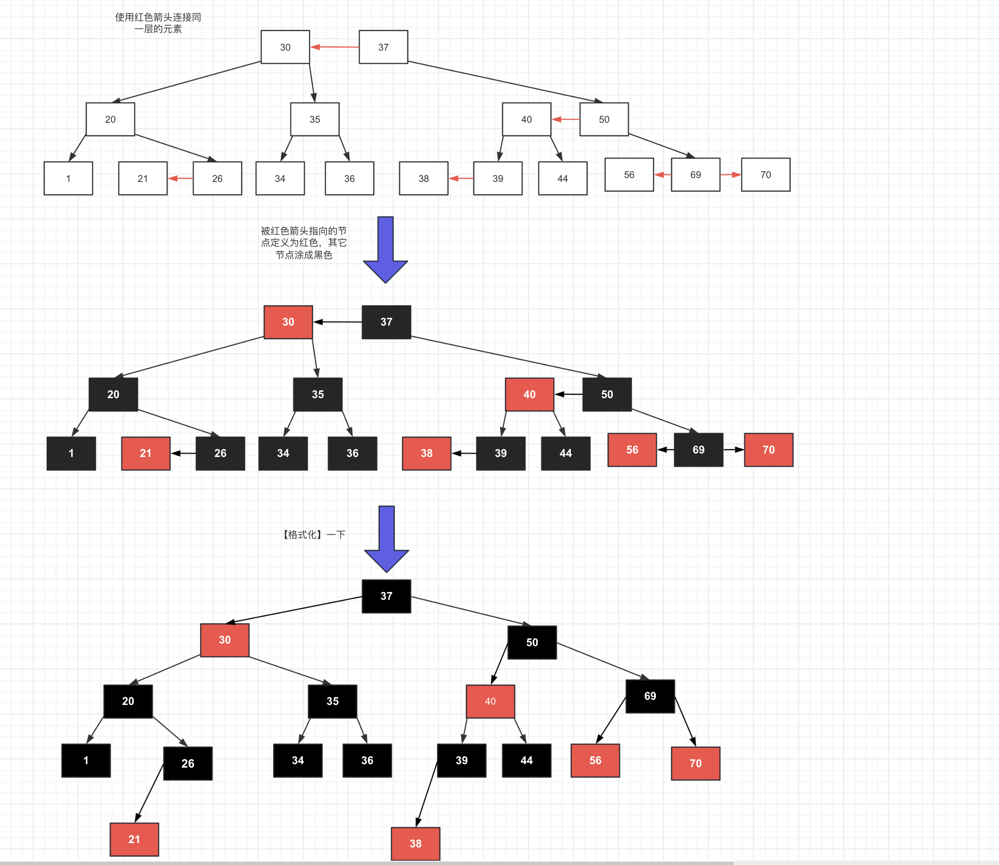

## 红黑树转化为4阶B树

如下图，有一棵红黑树，我们把红色节点与它的黑色父节点合并成一个节点，并且左子红色节点放在黑色节点的左边，右子红色节点放在黑色节点的右边，这样就得到一棵B树。

由于一个黑色节点最多连2个红色，所以B树的一个节点最多有3个元素，所以是一棵4阶B树

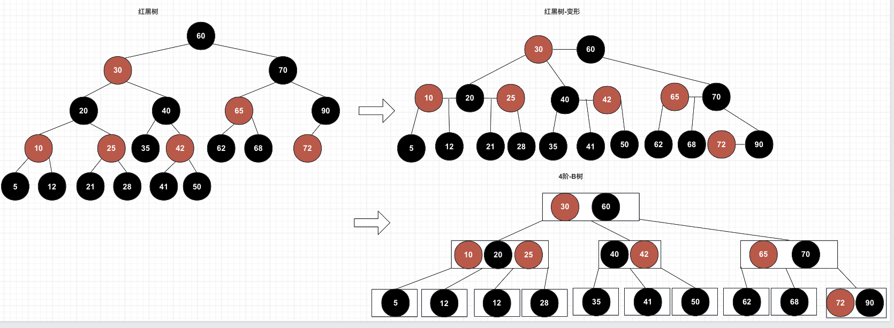

因为红黑树和4阶B树可以相互转换，因此，我们说红黑树和4阶B树是 `等价的`

既然是等价的，在对一棵红黑树进行添加和删除操作的时候，我们可以使用与它等价的4阶B树来进行算法的设计。

## 使用代码定义红黑树

我们知道，红黑树是一棵BST，结合之前AVL树，BST的讨论我们可以得出以下类图

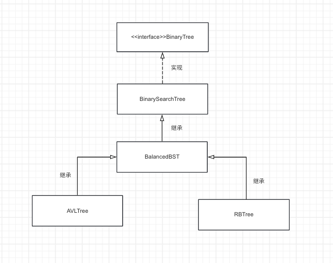

我们定义RBTree为红黑树，继承了BalancedBST (平衡二叉搜索树)，BalancedBST继承了BST，BST实现了二叉树BinaryTree接口

首先是BalancedBST, 其实就是把左旋右旋的操作提出来了，方便子类复用

```java
package cc.hammarr.binarytree;

public abstract class BalancedBinarySearchTree<E extends Comparable<E>> extends BinarySearchTree<E>{

    /**
     * |                  |
     *  g                 p
     * /   \             / \
     * p    y   =>      n   g
     * / \                 /  \
     * n pRight      pRight    y
     *
     * @param node
     */
    protected void rotateRight(Node<E> node) {
        // 带入p,g,pRight
        final Node<E> g = node;
        final Node<E> p =  g.left;
        final Node<E> pRight =  p.right;

        // 1. 更新左右
        g.left = pRight;
        p.right = g;

        // 2.更新parent
        // 2.1 更新p的parent
        p.parent = g.parent;
        if (g.isLeftChild()) {
            g.parent.left = p;
        } else if(g.isRightChild()) {
            g.parent.right = p;
        } else {
            root = p;
        }
        // 2.2 更新pRight的parent
        if (pRight != null) {
            pRight.parent = g;
        }
        // 2.3 更新g的parent
        g.parent = p;

       afterRotate(g, p);
    }


    protected void rotateLeft(Node<E> node) {
        // 带入p, g, pLeft
        final Node<E> g = node;
        final Node<E> p = g.right;
        final Node<E> pLeft = p.left;
        // 1. 更新左右节点
        g.right = pLeft;
        p.left = g;

        // 2. 更新parent
        // 2.1 让p称为根节点
        p.parent = g.parent;
        if (g.isLeftChild()) {
            g.parent.left = p;
        } else if (g.isRightChild()) {
            g.parent.right = p;
        }
        else {
            root = p;
        }

        // 2.2 让pLeft.parent指向g, 注意pLeft可能为空
        if (pLeft != null) {
            pLeft.parent = g;
        }

        // 2.3 让g.parent指向p
        g.parent = p;

        // 更新高度, 先更新g, 再更新p
        afterRotate(g, p);
    }

    protected void afterRotate(Node<E> g, Node<E> p) {
    }
}
```

```java
public class RBTree<E extends Comparable<E>> extends BalancedBinarySearchTree<E>{
    static final boolean RED = true;
    static final boolean BLACK = false;

    // 这是BinarySearchTree类中的方法，因为创建的节点可能是AVL树节点（包含高度信息)，也可能是RBTree节点(包含颜色信息)，因此BST中抽出这个方法供子类实现
    @Override
    protected Node<E> createNode(E element, Node<E> parent) {
        return new RBNode<>(element, parent);
    }

    // 红黑树节点的定义，在BST节点的基础上增加了color属性
    // 这里使用boolean值，true就是RED，false就是BLACK
    public static class RBNode<E extends Comparable<E>> extends BinarySearchTree.Node<E> {
        boolean color;

        RBNode(E element, Node<E> parent) {
            super(element, parent);
            this.color = RED;
        }

	// 用于获取兄弟节点，因为下面添加和删除都需要知道兄弟节点或者叔叔节点，因此需要这个方法
        public Node<E> sibling() {
            if (isLeftChild()) return this.parent.right;
            else if (isRightChild()) return this.parent.left;
            return null;
        }

    }

}
```

这里引入了BalancedBST, 其实是将AVL树和RB树的旋转操作抽出来，这属于自平衡树所拥有的操作。

或许这里还不理解为什么RB树需要旋转，往下看就明白了。

## 红黑树的添加操作

### 1. 添加的节点一定是B树的叶子节点

B的添加过程是从根节点开始比大小，只要你不是叶子节点，那一定有比你大或者小的下层节点，因此，无论什么值，最终一定都是找到叶子节点处，然后在叶子节点中从左到右找一个合适的位置插入。

### 2. 红黑树能转化为B树叶子节点的几种情况

如下，可以知道，红黑树能作为B树叶子节点的最后几层元素无非以下4种情况，因此我们讨论添加一个元素的情况也按这4类进行讨论

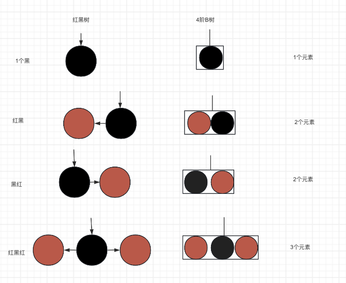

### 3. 插入节点的分情况讨论

为了能尽量地匹配红黑树的5条性质，规定新增的节点都是红色。

> 可以思考下为什么要插入红色？
>
> 如果插入黑色，那么这条路径一定不是黑色平衡的，为了达到平衡，我们可能既需要变色，又要旋转。
>
> 而如果插入红色，我们只需要考虑是否需要旋转，算法会简单很多

结合2的分析，乍一看我们似乎有12种情况需要考虑，但是我们思考一下

* 如果我们插入的节点是黑色节点，那么其实我们什么都不用做，因为红黑树的性质已经满足了。这样就少了4种情况，那么只剩下8种需要讨论

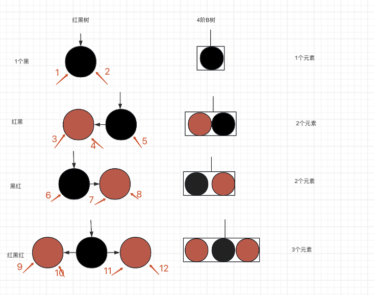

#### 约定

* 新增的节点叫n，
* 插入的节点叫p (n.parent 父亲)，
* 插入的节点的父节点叫g (n.parent.parent祖父),
* p的兄弟节点叫u (uncle 叔叔)

#### 情况1，2，5，6：插入到黑色节点下面

什么都不用做，满足条件

#### 情况3：红黑，插入红的左边 - LL+染色

如果，有50(黑)，40（红)的两个节点，我们要插入30, 也就是插入到40的左边。

这种情况对应4阶B树只有2个元素的叶子节点，**因此再容纳一个也不会产生上溢。**

**因此这种情况的红黑树也不需要改变影响上一层的节点。** 我们要做的就是想办法把30，40，50放到一个B树节点中。

很明显，我们把40作为中间节点，30和50放在两边，让上层的节点指向40不就行了。

这其实就是右旋+染色, 伪代码就是:

* p.color=BLACK
* g.color=RED
* rotateRight(g)

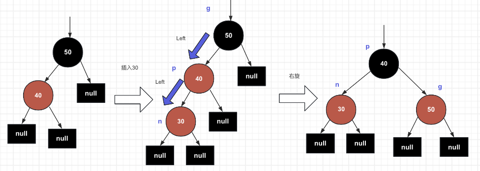

#### 情况4：红黑，插入红的右边-LR-双旋+染色

思路跟情况3差不多，也只是调整n,p,g的相对位置以及颜色就能满足红黑树的性质，看图说话，

需要p左旋，然后g右旋，因为旋转后n,p,g的父子关系会发生变化，所以建议先染色，再旋转 （当然也可以用临时变量记录n,p,g，先旋转再染色)

伪代码如下:

* n.color=black
* g.color=red
* rotateLeft(p)
* rotateRight(g)

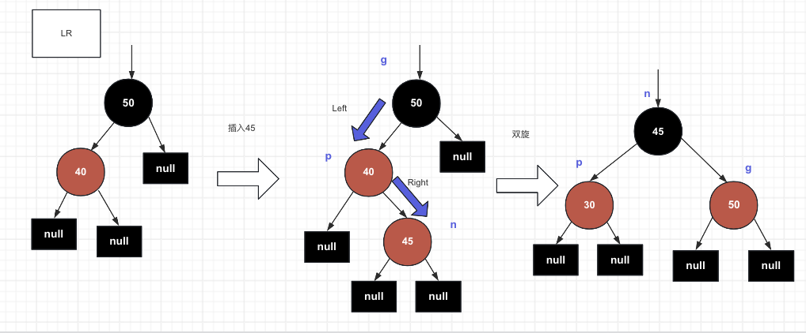

#### 情况8：黑红，插入红的右边-RR+染色

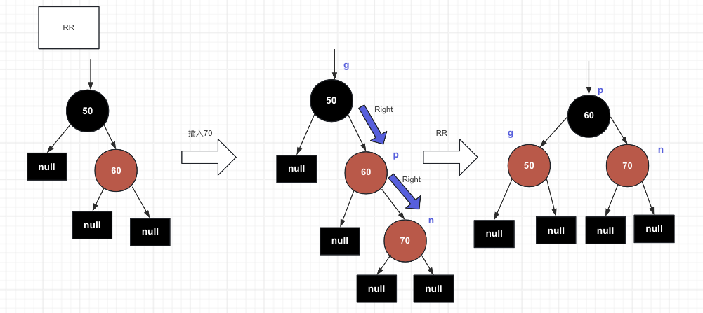

#### 情况7：黑红，插入红的左边-RL+染色

这个其实跟情况4是对称的，经过前面的分析，无需赘述。

伪代码如下：

* n.color=BLACK
* g.color=RED
* rotateRight(p)
* rotateLeft(g)

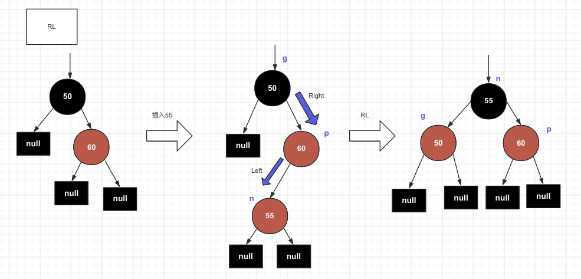

#### 情况9，10，11，12：红黑红，染色加向上迭代（或者递归)插入

这4种情况的处理方式其实是一样的，将g染成红色，将p和u染成黑色，然后递归或者迭代的向上插入g即可，迭代的处理可以复用之前讨论的所有情况的逻辑

对比4阶B树，其实就是叶子节点已经有3个节点了，再插入一个节点就会产生上溢，在B树的做法就是插入后取中间位置的节点进入上一层，如果上一层仍然上溢，则继续向上传播，直到根节点。

伪代码如下：

* g.color=RED
* p.color=BLACK
* u.color=BLACK
* add(g) (递归)

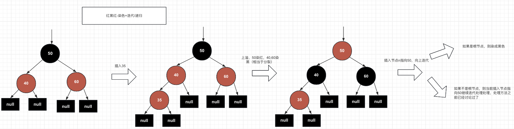

#### 如果区分双红还是单红

通过上面的讨论，大致可以分为以下几种情形

* 插入黑色节点的后面，无需处理
* 插入红黑或者黑红，也就是单红
* 插入红黑红，也就是双红

那么如何区分单红和双红呢？其实就是判断uncle叔父节点的颜色即可，uncle是黑，就是单红，uncle是红，就是双红。

### 4.代码实现

回顾一下BST的添加操作

```java
 public class BinarySearchTree<E extends Comparable<E>> implements BinaryTree<E> {
    // ....省略

    // 添加节点
    // 分了2种情况，
    // 如果是根节点, 创建新节点，如果不是，找到叶子节点，插入
    // 插入后调用后处理方法fixAfterInsertion()传入新创建的节点
    @Override
    public E add(E element) {
        if (root == null) {
            root = createNode(element, null);
            size = 1;
            fixAfterInsertion(root);
            return null;
        }
        Node<E> p = root;
        Node<E> parent;
        int cmp;

        do {
            parent = p;
            cmp = element.compareTo(p.element);
            if (cmp < 0) p = p.left;
            else if (cmp > 0) p = p.right;
            else return p.element(element);
        } while (p != null);

        Node<E> newNode = createNode(element, parent);
        if (cmp < 0) parent.left = newNode;
        else parent.right = newNode;
        size++;
        fixAfterInsertion(newNode);
        return null;
    }
```

fixAfterInsertion的逻辑

```java
    @Override
    protected void fixAfterInsertion(Node<E> node) {
        RBNode<E> parent = (RBNode<E>) node.parent;
        // 添加的是根节点
        if (parent == null) {
            color(node, BLACK);
            return;
        }
        // 情况1，2，5，6： 父节点是黑色
        if (isBlack(parent)) return;

        // 进入到这里parent一定是红色，判断是单红还是双红
        // uncle节点
        RBNode<E> uncle = (RBNode<E>)parent.sibling();
        // 祖父节点
        RBNode<E> grand = (RBNode<E>) parent.parent;


        // 双红，染色+递归
        // 1. parent, uncle染成黑色，grand染成红色
        // 2. 祖父节点向上合并
        if (isRed(uncle)) {
            color(parent, BLACK);
            color(uncle, BLACK);
            color(grand, RED);
            fixAfterInsertion(grand);
            return;
        }
 

	// 单红的处理, LL, RR, LR, RL
        if (parent.isLeftChild()) {
            if (node.isLeftChild()) {
                // LL
                // parent 染成黑色，grand染成红色, 右旋grand
                color(parent, BLACK);
                color(grand, RED);
                rotateRight(grand);
            } else {
                // LR
                // 自己染成黑色，grand染成红色, 左旋parent，右旋grand
                color(node, BLACK);
                color(grand, RED);
                rotateLeft(parent);
                rotateRight(grand);
            }
        } else {
            if (node.isRightChild()) {
                // RR
                // parent染成黑色，grand染成红色，左旋
                color(parent, BLACK);
                color(grand, RED);
                rotateLeft(grand);
            } else {
                // RL
                // 自己染成黑色，grand染成红色，右旋parent， 左旋grand
                color(node, BLACK);
                color(grand, RED);
                rotateRight(parent);
                rotateLeft(grand);
            }
        }
    }
```

## 红黑树的删除操作

### 1. 删除的节点一定是B树叶子节点

回顾一下B树的删除操作，

* 如果删除的是非叶子节点，就找到它的前驱和后继节点，替换后删除。前驱后继怎么找，比如找前驱，就找左子节点，然后一路往右下找，这个节点一定是叶子节点。(因为如果不是叶子结点，那一定有比这个节点更大的节点，而这个更大的节点又一定比要删除的节点要小，所以反证出这个节点一定不是前驱节点，所以前驱节点只能在叶子里。后继节点也是同理。)
* 如果删除的是叶子节点，就要看删除后节点是否小于$\lceil \frac m2 \rceil -1$, 如果小于，就要看兄弟节点有没有能借的
  * 如果兄弟节点数量足够，就借一个到父节点，父节点借一个下来与删除元素的节点合并
  * 如果兄弟节点数量不够，就从父节点借一个下来与当前节点还有兄弟节点合并成新节点，如果父节点也不够了，则继续向兄弟借或者从父节点取一个合并，一直迭代至根节点

可以看到B树的删除的都是叶子节点，删除后需要看兄弟节点有没有节点能借，能借则只需要做类似于旋转的操作，不能借则会产生下溢，合并节点，并不断向上传播下溢。

因此我们也要从红黑树的等价于4阶B树的叶子节点入手，分情况去分析。

### 2. 红黑树能转化为B树叶子节点的情况

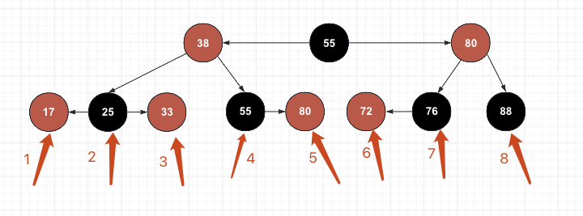

如图共8种情况

### 3. 删除节点的分情况讨论

#### 3.1 删除红色节点：情况1，3，5，6

直接删除，因为不影响红黑树的性质，什么都不用做

#### 3.2 删除拥有2个红色节点的黑色节点：情况2

使用黑色节点的左孩子或者右孩子代替它，然后删除红色孩子。其实这个替换的过程，在BST的删除操作中已经实现了，就是删除度为2的节点，寻找它的后继（或者前驱)覆盖当前值，然后删除后继节点。

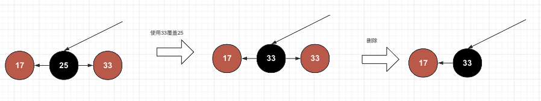

#### 3.3 删除拥有一个红色节点的黑色节点：情况4，7

从4阶B树的角度来看，这个也不会产生下溢，所做就是把黑色节点的红孩子染成黑色，代替他即可。换一种思路，其实就是使用红孩子的元素覆盖它，然后删除红孩子

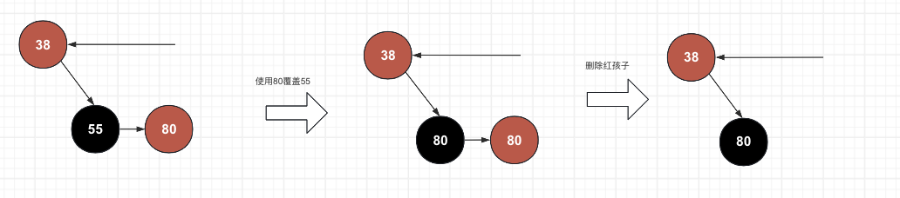

#### 3.4. 统一3.2，3.3：删除拥有红孩子的黑色节点，替换+删除

从3.2， 3.3的分析，我们可以将算法统一如下：

* 如果删除的是黑色节点，它有红孩子，则使用任意一个红孩子的值覆盖它，然后删除红孩子

其实本质上都是从4阶B树的一个节点删除一个元素，因为这种节点有2个或者3个元素，因此，原地删除即可，不需要影响其它节点，只需要让它符合红黑树的定义即可

#### 3.5 删除没有红孩子节点的黑色节点：情况8

从4阶B树的角度看问题，这个节点只有一个元素，如果删除，必然导致下溢，所以接下来的调整就要看兄弟节点有没有多余的节点。

兄弟节点什么情况下有多余的节点呢？

* 兄弟必须是黑色 （才能跟他同一层做兄弟)
* 兄弟必须有红色孩子 （红色侄子)

> 注意：n是待删除黑色节点，标成灰色，父节点可红可黑，标成紫色

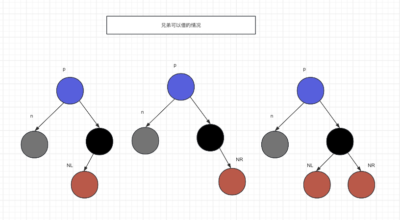

> **以下，为了方便讨论，我们默认讨论删除节点是父节点左孩子的情况，删除节点是右孩子的情况是对称的。并且约定**
>
> * n: 待删除节点
> * p: n的父节点
> * s： n的兄弟节点
> * NL: n的兄弟节点的左侄子
> * NR: n的兄弟节点的右侄子
> * 灰色：待删除的黑色节点
> * 紫色：可红可黑不影响结果的节点

##### 3.5.1 兄弟是黑色，并且兄弟有一个右红孩子

这种情况p>s>NR，我们希望的效果是，NR代替之前的s, p代替之前的n, s代替之前p

伪代码：

* s.color=p.color
* p.color=BLACK
* NR.color=BLACK
* rotateLeft(p)

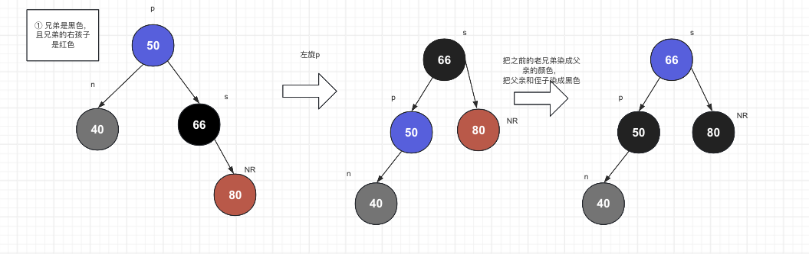

##### 3.5.2 兄弟是黑色，并且兄弟有一个左红孩子

这时候有p<NL<s, 我们的目标是用NL代替p, s还在之前的位置，p代替n

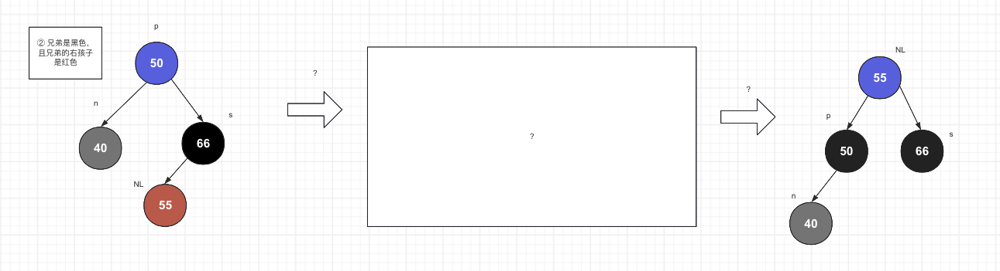

很明显，我们可以先右旋s, 再左旋p

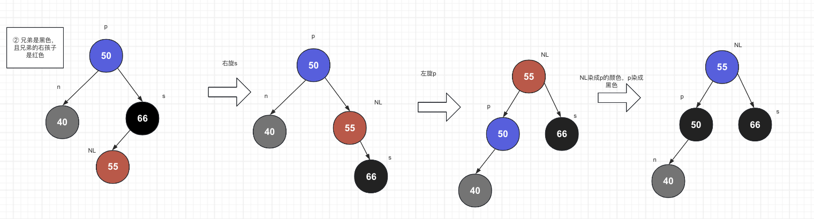

##### 3.5.3 兄弟是黑色，并且兄弟右2个左孩子

其实这种情况既可以左旋p，也可以先右旋s再左旋p，为了简单起见，我们左旋p一步到位，这个处理跟3.5.1是一样的

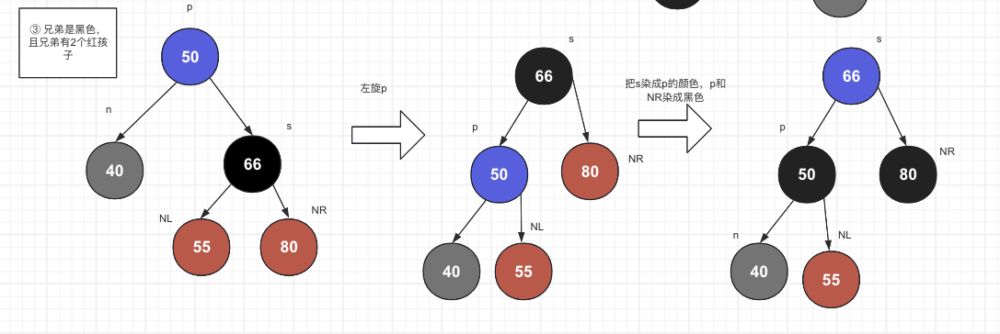

##### 3.5.4 兄弟是黑色，并且兄弟没有红孩子

从4阶B树的角度来看，其实就是兄弟也不够借，在B树里的做法就是父节点下来一个与兄弟合并成一个叶子节点，然后父节点的删除行为向上传播。

这里又有2种情况

* 父节点是红色：此时父节点直接借下来染成黑色即可
* 父节点是黑色：此时父节点必然只有一个元素（因为父亲的左右都有指向了)，父节点所在层产生下溢，需要递归删除父节点，这样又回到了删除没有红孩子的黑色节点的情况，也就是3.5所讨论的，直到遇到父节点是红色节点或者兄弟有足够的节点可以借的情况

所以要做的就是

* parentColor = p.color
* p.color=black
* s.color=RED
* if(parentColor==BLACK) fixAfterRemoval(p)

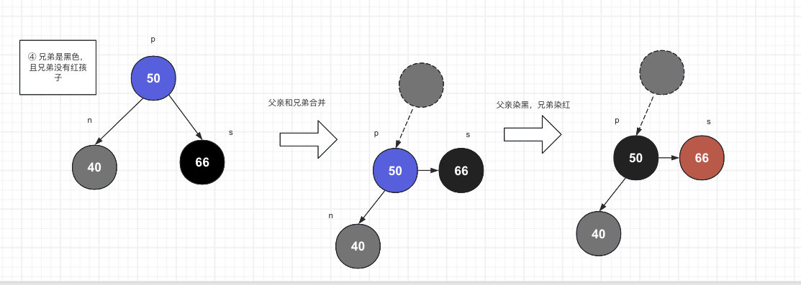

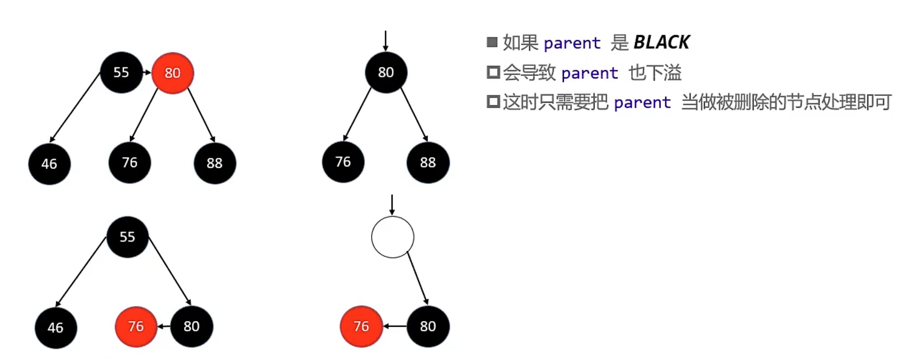

##### 3.5.5 兄弟是红色的分情况讨论

兄弟是红色说明了什么问题？

1. 父节点一定是黑色
2. 兄弟节点的子节点一定是黑色
3. 兄弟节点一定有2个黑色节点 (因为从4阶B树的角度看，p, s组成了双元素，双元素必须有3个分叉，再加上n必然是最后一层，因此s下面必须有2个黑色，这样从p到null节点经过的黑色节点才能相等)

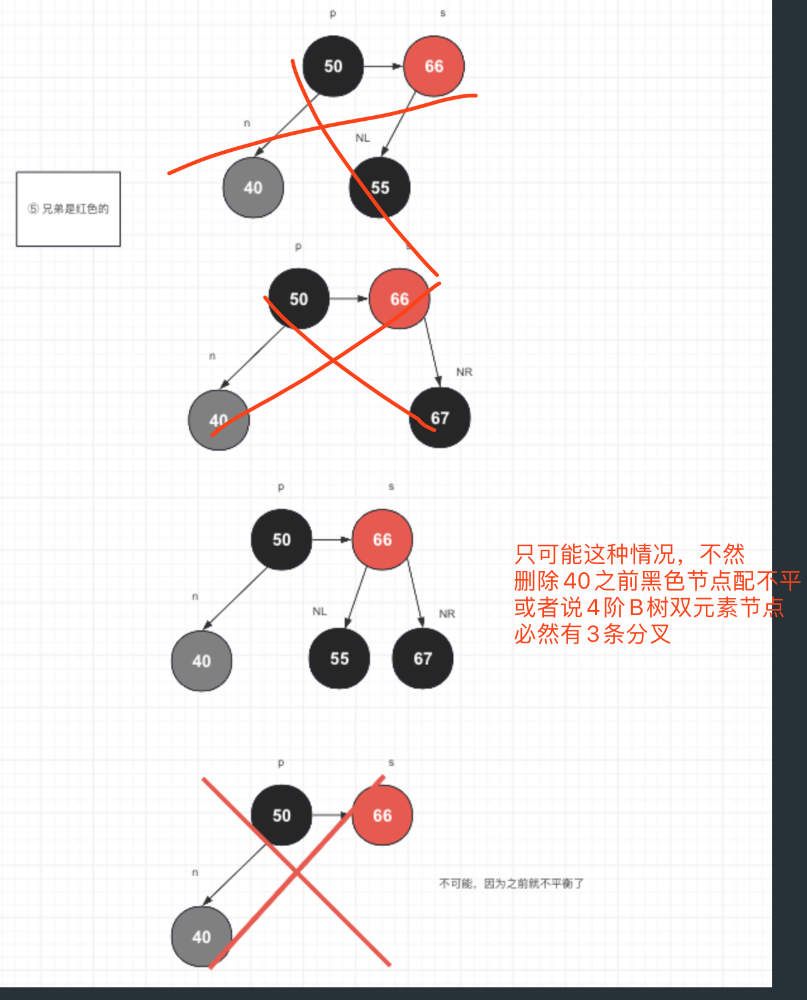

我们的想法是，兄弟节点分一个孩子给我当兄弟，也就是父节点的右节点需要指向兄弟的左节点，这不就是左旋吗？因为左旋后sp组成的节点的中心成了s，也就是p的父节点指向了s，那么s必须是黑色节点，所以要把s染成黑色，把p染成红色

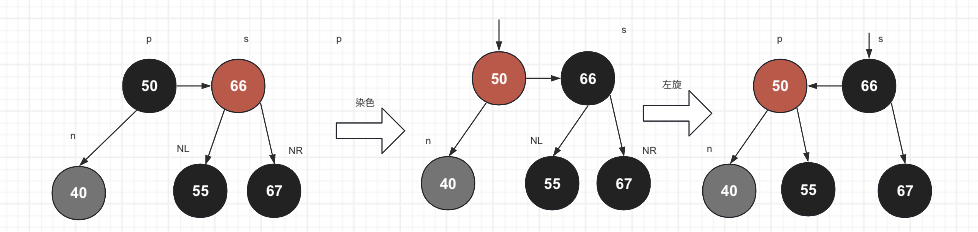

因此代码层面，我们可以先处理兄弟是红的情况，然后去处理兄弟为黑的情况

* parent.color=RED
* sibling.color=BLACK
* rotateLeft(parent)
* sibling=parent.right // 主要要更新兄弟
* handleBlackSibling(node)

### 4. 删除的代码实现

```java
 /**
     * node-待删除节点
     * replacement-取代node的节点
     *
     * @param node
     * @param replacement
     */
    @Override
    protected void fixAfterRemoval(Node<E> node, Node<E> replacement) {
        // 删除红色不用处理
        if (isRed(node)) return;
        // 染色即可
        if (isRed(replacement)) {
            color(replacement, BLACK);
            return;
        }
        Node<E> parent = node.parent;
        // 如果删除的是根节点
        if (parent == null) return;

        // 删除黑色节点
        boolean isLeft = parent.left == null || node == parent.left;
        if (isLeft) {
            Node<E> sibling = node.parent.right;
            // 兄弟为红
            if (colorOf(sibling) == RED) {
                // 1. 要把左侄子拿过来当兄弟，所以要左旋p
                // 2. 将父亲染红，兄弟染黑，
                color(parent, RED);
                color(sibling, BLACK);
                rotateLeft(parent);
                sibling = parent.right;
            }
            // 兄弟为空, 父节点下来并染黑,递归修复父节点
            if ((colorOf(sibling.left) == BLACK && colorOf(sibling.right) == BLACK)) {
                boolean isParentBlack = colorOf(parent) == BLACK;
                color(parent, BLACK);
                color(sibling, RED);
                if (isParentBlack) {
                    fixAfterRemoval(parent, null);
                }
            }
            // 兄弟为黑, 且至少有一个红孩子
            else  {
                // 我们期望的是RR的情况，这样左旋即可
                // 符合RR的右兄弟的左右孩子都是红，或者兄弟的右孩子为红，左孩子为空
                // 所以遇到兄弟的左孩子为红，右孩子为空的情况，需要先转成RR的状态
                if (colorOf(sibling.right) == BLACK) {
                    rotateRight(sibling);
                    // 注意更新兄弟，因为侄子变成了兄弟
                    sibling = parent.right;
                }

                color(sibling, colorOf(parent));
                color(sibling.right, BLACK);
                color(parent, BLACK);
                rotateLeft(parent);
            }


        } else { // 对称操作

            Node<E> sibling = node.parent.left;
            // 兄弟为红
            if (colorOf(sibling) == RED) {
                // 1. 要把右侄子拿过来当兄弟，所以要右旋p
                // 2. 将父亲染红，兄弟染黑
                color(parent, RED);
                color(sibling, BLACK);
                rotateRight(parent);
                sibling = parent.left;
            }

            // 父节点下来并染黑,递归修复父节点
            if ((colorOf(sibling.right) == BLACK && colorOf(sibling.left) == BLACK)) {
                boolean isParentBlack = colorOf(parent) == BLACK;
                color(parent, BLACK);
                color(sibling, RED);
                if (isParentBlack) {
                    fixAfterRemoval(parent, null);
                }
            }
            // 兄弟为黑, 且至少有一个红孩子
            else {
                // 兄弟左边是黑，先旋转
                if (colorOf(sibling.left) == BLACK) {
                    rotateLeft(sibling);
                    sibling = parent.left;
                }

                rotateRight(parent);
                color(sibling, colorOf(parent));
                color(parent, BLACK);
                color(sibling.left, BLACK);
            }


        }
    }
```

## 复杂度分析

* 查询：O(logn)
* 添加：O(logn)
* 删除：O(logn)

## 总结

本篇讨论了红黑树是什么以及添加和删除操作

1. 红黑树可以看做是4阶B树（也叫2-3-4树)的等价变换，是一种自平衡的二叉搜索树
2. 红黑树的5条性质
   1. 所有节点不是红就是黑
   2. 根节点是黑色
   3. 叶子节点为null，并且是黑色
   4. 不能有2个连续的红色节点 ，等价的说法: 红色节点的子节点必须是黑色
   5. 黑色平衡，也就是从根节点到叶子节点经过的黑色节点数量必须相同
3. 红黑树的添加操作
   1. 添加操作一定是4阶B树的最后一层，因此必须是红黑树的最后两层
   2. 新添加的元素必须是红色，能最快的满足红黑树的性质
   3. 从插入节点的角度分情况讨论：
      1. 如果插入的是根节点，染成黑色即可
      2. 父亲是黑色，无需处理
      3. 根据叔叔节点的颜色，判断是红黑红，还是红黑，还是黑红
         * 如果叔叔是红，则是红黑红的情况，此时只需要把父亲和叔叔变黑，祖父变红，递归向上插入祖父
         * 如果叔叔是黑，则是红黑或者黑红，此时需要判断根据父节点是祖父节点的左孩孩子还是右孩子判断
           * 如果父节是左孩子，自己是左孩子，就是LL的情况，需要把父亲染黑，祖父染红，然后右旋转祖父；
           * 如果父亲是左孩子，自己是右孩子，就是LR情况，需要把自己染黑，祖父染红，先左旋父亲，再右旋祖父
           * 如果父亲是右孩子，自己是右孩子，就是RR情况，需要把父亲染黑，祖父染红，然后左旋转祖父
           * 如果父亲是右孩子，自己是左孩子，就是RL情况，需要把自己染黑，祖父染红，先右旋父亲，再左旋祖父
4. 红黑树的删除操作
   1. 删除操作一定是4阶B树的最后一层，因此也必须是红黑树的最后两层
   2. 如果删除的元素有2个孩子，就找它的后继（前驱也行)节点，后继节点的值覆盖它的值，然后处理后继节点
   3. 此时只剩下处理红黑树的最后两层，需要分情况讨论
      1. 如果删除的是红色节点，无需处理
      2. 如果删除是有一个红色子节点的黑色节点，将替代的红色节点染成黑色即可
      3. 如果删除的是有2个红色子节点的黑色节点，则使用后继红色节点的值替代它，然后删除红色节点
      4. 如果删除的是没有红色子节点的黑色节点，可以分情况讨论，
         1. 如果当前节点是左孩子，判断兄弟节点是红还是黑，红色话要把兄弟转成黑色，黑色的话要判断兄弟有没有红孩子可以借
            1. 兄弟是黑，兄弟没有孩子，则把兄弟变红，父节点变黑，组成四阶B树的一个叶子节点
               1. 如果父节点本来是红，说明父层节点够用，处理完成
               2. 如果父节点本来是黑，说明父层节点只有一个元素，向上递归删除父节点，也就是下溢的向上传播，会导致节点向下合并
            2. 兄弟是黑，有一个左红孩子，则先右旋转兄弟，再左旋转父亲，并且把做红孩子染成父亲的颜色，把父亲染成黑，兄弟染成红
            3. 兄弟是黑，有一个右红孩子，则左旋父亲，把兄弟染成父亲的颜色，父亲染成黑，兄弟染成红
            4. 兄弟是黑，有2个红孩子，则执行3的操作
            5. 兄弟是红，则兄弟必有2个黑孩子，则左旋父亲，把兄弟变成黑色，然后执行1-4
         2. 如果当前节点是右孩子，镜像执行1的操作。
5. 复杂度
   查询, 添加，删除的复杂度都是O(logn)
