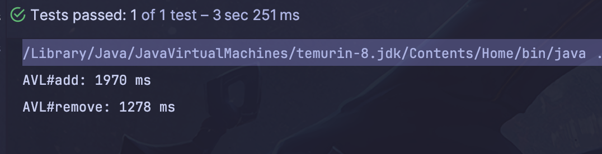
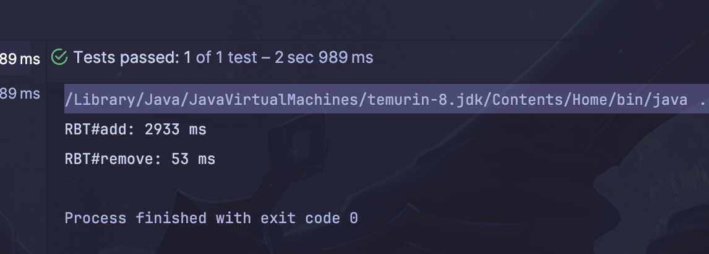
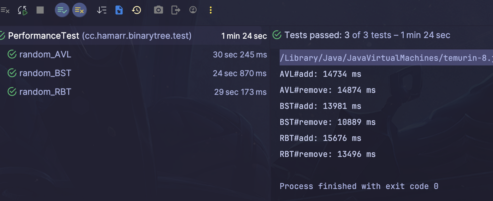

## 1. 顺序插入和删除1000w

### BST

```java
    @Test
    public void inorder_BST() {
        long start = System.currentTimeMillis();
        BinarySearchTree<Integer> bst = new BinarySearchTree<>();
        for (int i=1;i<=1000_0000; i++) {
            bst.add(i);
        }
        System.out.println("BST#add: " + (System.currentTimeMillis() - start) + " ms");
        start = System.currentTimeMillis();
        for (int i=1000_0000; i>= 1; i--) {
            bst.remove(i);
        }
        System.out.println("BST#remove: " + (System.currentTimeMillis() - start) + " ms");
    }
```

结果：反正是很久很久都没结果，就算超时吧...

### AVL

```java
@Test
    public void inorder_AVL() {
        long start = System.currentTimeMillis();
        AVLTree<Integer> bst = new AVLTree<>();
        for (int i=1;i<=1000_0000; i++) {
            bst.add(i);
        }
        System.out.println("AVL#add: " + (System.currentTimeMillis() - start) + " ms");
        start = System.currentTimeMillis();
        for (int i=1000_0000; i>= 1; i--) {
            bst.remove(i);
        }
        System.out.println("AVL#remove: " + (System.currentTimeMillis() - start) + " ms");
    }
```



### RBT

```java

 @Test
    public void inorder_RBT() {
        long start = System.currentTimeMillis();
        RBTree<Integer> bst = new RBTree<>();
        for (int i=1;i<=1000_0000; i++) {
            bst.add(i);
        }
        System.out.println("RBT#add: " + (System.currentTimeMillis() - start) + " ms");
        start = System.currentTimeMillis();
        for (int i=1000_000; i>= 1; i--) {
            bst.remove(i);
        }
        System.out.println("RBT#remove: " + (System.currentTimeMillis() - start) + " ms");
    }
```



## 2. 随机插入和删除1000w

数据准备

测试类的静态变量，这样一次跑3个测试，3个测试方法拿到的随机数都是一样的

```java

    static int size = 1000_0000;
    static List<Integer> data = new ArrayList<>(size);
    static  {
        for (int i=1;i<=size; i++) {
            data.add(i);
        }
        Collections.shuffle(data);
    }
```

### BST

```java
@Test
    public void random_BST() {
        long start = System.currentTimeMillis();
        BinarySearchTree<Integer> bst = new BinarySearchTree<>();
        for (int i=0; i< size; i++) {
            bst.add(data.get(i));
        }

        System.out.println("BST#add: " + (System.currentTimeMillis() - start) + " ms");
        start = System.currentTimeMillis();
        for (int i=0; i<size; i++) {
            bst.remove(data.get(i));
        }
        System.out.println("BST#remove: " + (System.currentTimeMillis() - start) + " ms");
    }
```

### AVL

```java
 @Test
    public void random_AVL() {
        long start = System.currentTimeMillis();
        AVLTree <Integer> tree = new AVLTree<>();
        for (int i=0; i< size; i++) {
            tree.add(data.get(i));
        }

        System.out.println("AVL#add: " + (System.currentTimeMillis() - start) + " ms");
        start = System.currentTimeMillis();
        for (int i=0; i<size; i++) {
            tree.remove(data.get(i));
        }
        System.out.println("AVL#remove: " + (System.currentTimeMillis() - start) + " ms");
    }
```

### RBT

```java
 @Test
    public void random_RBT() {
        long start = System.currentTimeMillis();
        AVLTree <Integer> tree = new AVLTree<>();
        for (int i=0; i< size; i++) {
            tree.add(data.get(i));
        }

        System.out.println("RBT#add: " + (System.currentTimeMillis() - start) + " ms");
        start = System.currentTimeMillis();
        for (int i=0; i<size; i++) {
            tree.remove(data.get(i));
        }
        System.out.println("RBT#remove: " + (System.currentTimeMillis() - start) + " ms");
    }
```

结果



## 3. 总结

顺序插入和删除的场景下，

* BST遇到大数据量很容易超时，因为已经退化成链表了，操作都是O(n)级别的
* AVL的添加操作跟RBT表现差不多，比RBT好一些。因为AVL添加操作只需要旋转1-2次就可以使整棵树平衡，而RBT可能存在一些上溢的情况，会旋转多次。
* AVL的删除操作比RBT差很多，因为当AVL某一子树整体变矮了，就会导致这棵树调整，在顺序删除时很容易发生（因为总是删掉一边的数据)，RBT没有这个问题，RBT的删除调整虽然也会向上传播，但是一旦兄弟节点有红色可以借或者父节点是红色可以借，传播就停止了。其实从4阶B树的角度更好理解，一个节点可以容纳1-3个元素，所以相当于有很多buffer。

随机插入和删除的场景下，

* BST， AVL， RBT的性能差不多，BST是最好的，因为不需要额外的重新平衡操作
* AVL的插入性能会比RBT好一些，因为只需要旋转1-2次就可以重新平衡，而RBT如果产生了上溢可能需要多次调整，但是调整次数也是有限的。
* AVL的删除性能会比RBT差一些，因为AVL删除的再平衡会向上传播，调整的次数不确定，如果数据分布的不是很好会一直传播到根节点，而RBT删除红色节点或者调整到遇到兄弟节点有多余节点可以借或者父节点有多余节点可以借的时候就可以停止调整。


综上，在性能和稳定性的综合表现上RBT>AVL>BST
