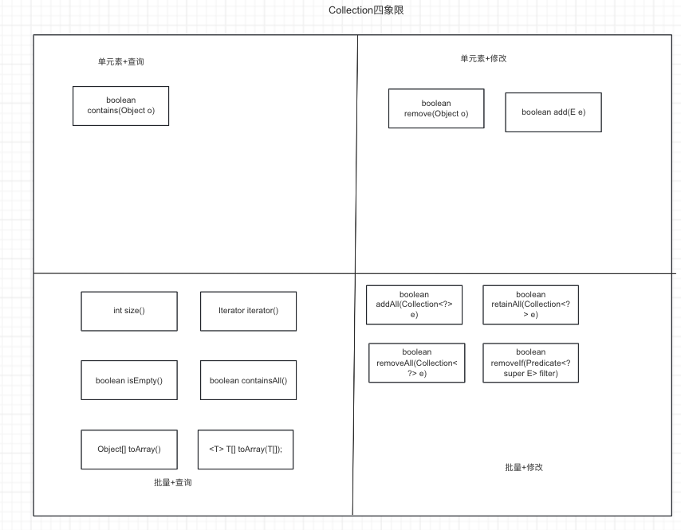

Collection是集合类的顶级接口。

## 1. 集合是什么?

Java的Collection位于java.util包，是集合类顶级接口。先来读一读源码中对于集合的定义

>The root interface in the collection hierarchy. A collection represents a group of objects, known as its elements. Some collections allow duplicate elements and others do not. Some are ordered and others unordered. The JDK does not provide any direct implementations of this interface: it provides implementations of more specific subinterfaces like Set and List. This interface is typically used to pass collections around and manipulate them where maximum generality is desired.
>
>Bags or multisets (unordered collections that may contain duplicate elements) should implement this interface directly.
>
>All general-purpose Collection implementation classes (which typically implement Collection indirectly through one of its subinterfaces) should provide two "standard" constructors: a void (no arguments) constructor, which creates an empty collection, and a constructor with a single argument of type Collection, which creates a new collection with the same elements as its argument. In effect, the latter constructor allows the user to copy any collection, producing an equivalent collection of the desired implementation type. There is no way to enforce this convention (as interfaces cannot contain constructors) but all of the general-purpose Collection implementations in the Java platform libraries comply.
>
>The "destructive" methods contained in this interface, that is, the methods that modify the collection on which they operate, are specified to throw UnsupportedOperationException if this collection does not support the operation. If this is the case, these methods may, but are not required to, throw an UnsupportedOperationException if the invocation would have no effect on the collection. For example, invoking the addAll(Collection) method on an unmodifiable collection may, but is not required to, throw the exception if the collection to be added is empty.
>
>Some collection implementations have restrictions on the elements that they may contain. For example, some implementations prohibit null elements, and some have restrictions on the types of their elements. Attempting to add an ineligible element throws an unchecked exception, typically NullPointerException or ClassCastException. Attempting to query the presence of an ineligible element may throw an exception, or it may simply return false; some implementations will exhibit the former behavior and some will exhibit the latter. More generally, attempting an operation on an ineligible element whose completion would not result in the insertion of an ineligible element into the collection may throw an exception or it may succeed, at the option of the implementation. Such exceptions are marked as "optional" in the specification for this interface.
>
>It is up to each collection to determine its own synchronization policy. In the absence of a stronger guarantee by the implementation, undefined behavior may result from the invocation of any method on a collection that is being mutated by another thread; this includes direct invocations, passing the collection to a method that might perform invocations, and using an existing iterator to examine the collection.
>
>Many methods in Collections Framework interfaces are defined in terms of the equals method. For example, the specification for the contains(Object o) method says: "returns true if and only if this collection contains at least one element e such that (o==null ? e==null : o.equals(e))." This specification should not be construed to imply that invoking Collection.contains with a non-null argument o will cause o.equals(e) to be invoked for any element e. Implementations are free to implement optimizations whereby the equals invocation is avoided, for example, by first comparing the hash codes of the two elements. (The Object.hashCode() specification guarantees that two objects with unequal hash codes cannot be equal.) More generally, implementations of the various Collections Framework interfaces are free to take advantage of the specified behavior of underlying Object methods wherever the implementor deems it appropriate.
>
>Some collection operations which perform recursive traversal of the collection may fail with an exception for self-referential instances where the collection directly or indirectly contains itself. This includes the clone(), equals(), hashCode() and toString() methods. Implementations may optionally handle the self-referential scenario, however most current implementations do not do so.

在通义千问帮助下总结如下

* Collection是集合框架的顶级接口，没有直接的实现。具体的实现是继承子接口进行细分的，如List, Set, Queue
* 实现Collection接口的具体实现类必须有一个无参构造和一个包含Collection集合参数的有参构造
* 集合的元素不强调顺序，可以是有序，也可以是无序。取决于具体实现
* 集合的元素可以重复，也可以不重复，取决于具体的实现
* 修改类型的操作的实现是可选的，如果实现类不支持，应该抛出Unsupported, 但这不是强制性要求
* 使用clone， equals，hashCode, toString等方法需要谨慎，可能会造成无限递归

## 2. 常用操作

操作有很多，但是可以从两个维度去分类

1. 按照操作元素的数量
   * 单个元素操作
   * 批量操作 （流式操作也可以划到这个范围)
2. 按照操作类型分类
   * 查询操作
   * 修改操作（新增、删除)




### 2.1 查询单元素

```java
boolean contains(Object o);
```

### 2.2 修改单元素

```java
boolean add(E e);
boolean remove(Object o);
```

### 2.3 批量查询

```java
int size();
boolean isEmpty();

boolean containsAll();

Iterator iterator();


Object[] toArray();
<T> T[] toArray(T[] a);

// 特殊的，JDK8新增的流式操作
Stream<E> stream();
```

### 2.4 批量修改

```java
boolean addAll(Collection<? extends E>);
boolean removeAll(Collection<? extends E>);
boolean retainAll(Collection<? extends E>);

boolean removeIf(Predicate<? super E> filter);
```

## 3. 总结

这一篇梳理了Collection的概念和常用API

1. Collection对应数学上的`集合`, 表示一组元素或对象的集合，没有顺序，可以重复。
2. 常用API按照`操作类型`和`操作数量`分为4类:
   * 查询单个元素
   * 批量查询
   * 修改单个元素
   * 批量修改
