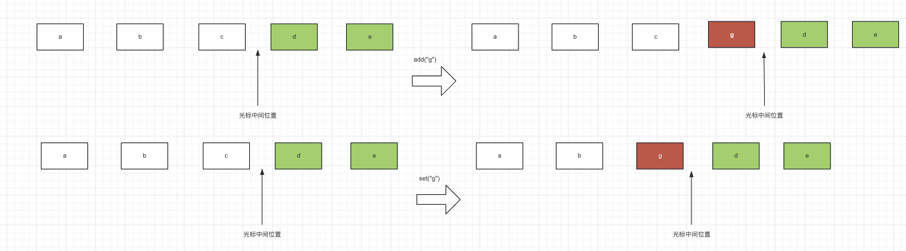

## 1. List是什么

需要思考一下：List是什么?

* 首先它是一个Collection,
* 它是一个特殊的集合，特殊在集合的元素有顺序，因为有顺序，所以可以对集合中的元素进行编号。

也因此，在Collection暴露的公共方法之外，List还增加了指定索引下标的操作以及排序操作。

## 2. List的操作

List的操作很多增删改查是基本的操作，因为相比于Collection多了一个`下标`的维度，所以还按4个象限去划分是不合适的，这里就按照List的文档按操作的类型去划分

1. 查询操作

2. 修改操作

3. 批量操作

4. 下标访问操作

5. 搜索操作

6. 视图操作

其中1-3是来自于Collection，4-6是List特有的

### 2.1 查询操作

查询操作查询的是什么？无非就是元素是否存在，集合的大小，是否为空，对元素进行遍历

```java
int size();
boolean isEmpty();
boolean contains(Object o);

```


### 2.2 修改操作

```java
boolean add(E e);
boolean remove(Object o);
```

### 2.3 批量操作

```java
boolean containsAll(Collection<?> c);
boolean addAll(Collection<? extends E> c);
boolean addAll(int index, Collection<? extends E> c);
boolean removeAll(Collection<?> c);
boolean retainAll(Collection<?> c);
default void replaceAll(UnaryOperator<E> operator) {
    Objects.requireNonNull(operator);
    final ListIterator<E> li = this.listIterator();
    while (li.hasNext()) {
        li.set(operator.apply(li.next()));
    }
}
void clear();
```

### 2.4 下标访问操作 （下标->元素的映射)

```java
E get(int index);
E set(int index, E element);
void add(int index, E element);
E remove(int index);
```

### 2.5 搜索操作(元素->下标的映射)

```java
int indexOf(Object o);
int lastIndexOf(Object o);
```

### 2.6 视图操作

这里转换为数据的操作我把它放到了视图分类中，因为我认为转换成数组，其实是转换成数组的`视图`

```java
Object[] toArray();
<T> T[] toArray(T[] a);

List<E> subList(int fromIndex, int toIndex);
@Override
default Spliterator<E> spliterator() {
    return Spliterators.spliterator(this, Spliterator.ORDERED);
}
```


### ## 3.谈谈ListIterator

> ListIterator和Iterator的区别

首先看下Iterator有哪些操作

```java
public interface Iterator<E> {
   	// 是否有下一个元素
    boolean hasNext();

   	// 返回下一个元素
    E next();

   	// 删除光标前一个元素，也就是上一次调用next()返回的元素
    default void remove() {
        throw new UnsupportedOperationException("remove");
    }
  	// 迭代+对元素进行操作
    default void forEachRemaining(Consumer<? super E> action) {
        Objects.requireNonNull(action);
        while (hasNext())
            action.accept(next());
    }
}
```

再看看ListIterator有哪些操作

```java
public interface ListIterator<E> extends Iterator<E> {
 		// 继承自Iterator
    boolean hasNext();
    E next();

 		// ListIterator独有的
  	
  	// 是否有前一个
    boolean hasPrevious();
  	// 返回前一个
    E previous();
		// 下一个元素下标
    int nextIndex();
		// 前一个元素下标
    int previousIndex();
		// 是继承自Iterator, 但是语义发生了变化=> 返回最近一次next()或者previous返回的元素
    void remove();

  	// 修改光标前一个元素
    void set(E e);
		// 插入到光标前一个元素
    void add(E e);
}
```

有几个操作因为引入了previous的概念，不是很好理解。其实可以把ListIterator看做是`光标`的移动。`光标`可以看做是2个元素之间的位置


图示set, add的用法



所以总结下ListIterator和Iterator的区别

* ListIterator可以遍历的同时获取元素的下标，Iterator不行

* ListIterator可以向前遍历，Iterator不行
* ListIterator可以遍历的过程中插入和修改元素，Iterator不行

## 3. 总结

这一篇回顾了List的概念，以及常用的API。

1. List是Collection概念的子集，所以List是个集合，但是List的特点是有`顺序`， 有顺序就意味着可以对元素进行编号和排序，因此List有`下标`的概念
2. List的API也可以根据`操作类型`和`操作数量`分为4类，但是因为List多了个`下标`维度，如果对每种类型+数量的组合进行是否是下标的拆分，那层次就太多了，因此这里使用JDK文档的分类方式，按照操作的类型去划分，不区分是操作单个元素还是多个元素。
   * 查询操作(Query): 询问集合的大小，是否为空，元素是否存在
   * 修改操作(Modification)： 追加，末尾删除
   * 批量操作(Bulk)：批量添加，批量删除，批量留存(retain),  条件删除, 清空
   * 下标访问操作(Postional): 是下标->元素的映射。包括get, set, remove,
   * 搜索操作(Search): 是元素->下标的映射。包括indexOf, lastIndexOf()
   * 视图操作(View): 视图我理解就是一个集合空间经过映射函数映射到另一个集合空间。包括获取子集，转换成数组

3. 针对List的另一个特殊点ListIterator, 讨论了它与Collection继承的Iterator的区别。ListIterator继承自Iterator， 因为List的有序的特点，增强了以下操作，也就是不同点。
   * 可以向前遍历
   * 遍历的同时可以获取元素的下标
   * 可以在游标的前一个位置新增或者修改一个元素
