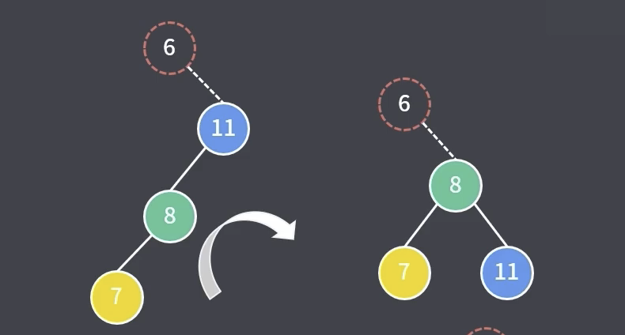
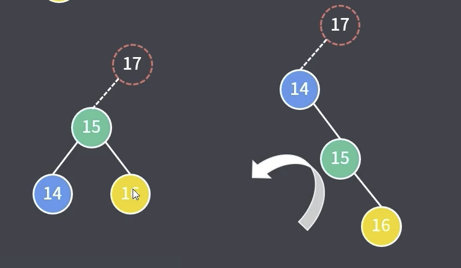

AVL的旋转

调整最小不平衡树。旋转可以降低树的高度，这样搜索的logn复杂度就可以降低。

右单旋转：LL平衡旋转， 第一个L当前节点的左子节点，第二个L是当前节点的左子节点的左节点插入数据导致不平衡。向右旋转一次

左单旋转：RR平衡旋转，右孩子节点的右子节点插入了一条数据，导致了不平衡

先左后右双旋转：LR平衡旋转。在当前节点的左子树的右子树 插入一个节点，导致不平衡

1. 每个节点不是红就是黑
2. 根节点必须是黑色
3. 新增一个节点必须是红色
4. 每条根节点到叶子节点的路径包含相同数量的黑色节点
5. 没有一条路径包含2个连续的红色节点
6. 空节点是黑色

如果新增/删除一个节点，破坏了这6条规则，怎么办？

1. Rebalance: 再平衡
   * 如果我们有黑色的叔节点，就旋转
   * 如果我们有红色的叔节点，就调换颜色
