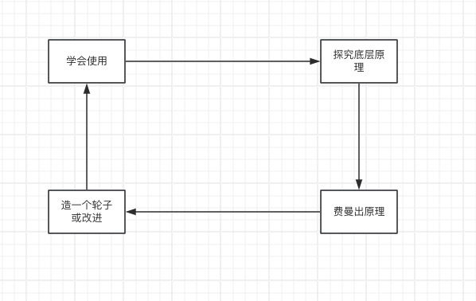

Java集合类是可以看做是数据结构和算法在Java中的应用，我们每天开发的所有程序都离不开Java集合类。因为程序可以看做指令+数据的集合，而存储指令或者数据必须需要一个容器去装，这个容器就是Java集合类。
想系统地总结Java集合类已经很久了，平时用的时候大都是来源于经验和往上零散的文章，但是其实一直不成体系，所以这几天花点时间全面系统地总结一下。
总结的过程我认为是是一个二次学习的过程，那学习一个新技术，我认为主要有以下几个步骤：

1. 学会使用。
2. 探究原理。
3. 将所学`费曼`出来。`费曼`学习法或者叫`费曼技巧`是一种`以教代学`的学习方法，即当你学完一个知识点后，你可以用简单的话语或文字描述出来，以至于不具有这方面专业知识的人也能听懂或看懂，那说明你是真的理解了，这种学习方式得到的知识也很难遗忘。
4. 扩展和创造。这个我觉得是比较难的，在明白了基本原理后，如果能自己仿造一个技术，甚至能在原有的技术上加以改进，在实践的过程中发现和解决问题，能帮助我们更深刻的理解技术的本质。

基于以上四点， 我把这套总结分成三个部分

1. 实战篇: 这部分主要是把常用的集合类用一用，算是复习一下
2. 原理篇：针对常用的集合类，一个个分析实现原理。
3. 轮子篇：根据原理篇的分析自己实现一套集合类，也算是对之前所学的一个实践和总结。

在写这三个部分过程中，其实也是尝试去`费曼` 知识点的过程, 希望通过这部分的学习，自己对Java集合类的理解能更上一层楼。
