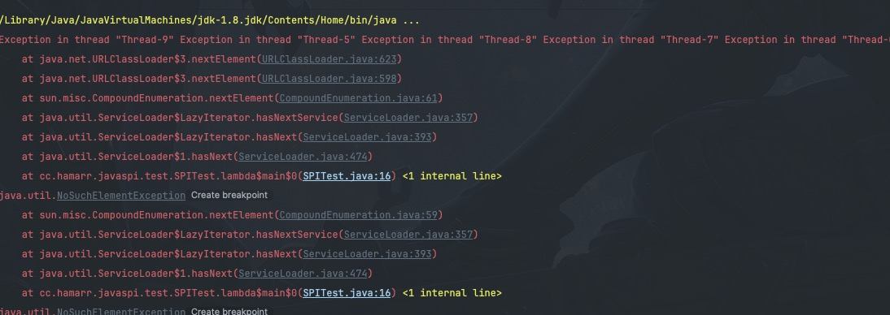
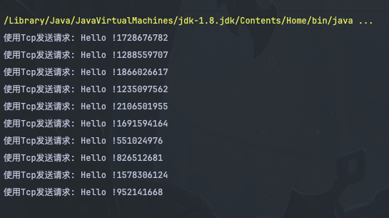

## ServiceLoader的工作机制
ServiceLoader加载服务主要包括以下几个步骤:
1. 创建并初始化ServiceLoader
2. 查找服务配置 (第一次调用hasNext()就把类路径下所有配置文件名都获取到了)
3. (懒惰)解析配置
4. (懒惰)遍历实现类名
5. (懒惰)加载实现类并实例化
可以看到除了创建和初始化ServiceLoader以及查找服务配置， 其它的查找、解析、遍历、加载类并实例化都是懒惰进行的


回顾一下SPI的使用，我将其拆成了几个代码片段，逐一分析
```java
package cc.hamarr.javaspi.test;

import cc.hamarr.javaspi.protocol.v2.IProtocol;

import java.util.Iterator;
import java.util.ServiceLoader;

public class SPITest {

    public static void main(String[] args) {
        // 代码片段1
        ServiceLoader<IProtocol> loader = ServiceLoader.load(IProtocol.class);
        // 代码片段2
        Iterator<IProtocol> iterator = loader.iterator();
        IProtocol service = null;
        // 代码片段3
        if (iterator.hasNext()) {
            // 代码片段4
            service = iterator.next();
        }

        if (service != null) {
            service.sendRequest("Hello !");
        }
    }
}
```
除此以外，我又加了个`代码片段0`，作为后续代码片段分析的铺垫.

### 代码片段0: 属性和构造方法
分析一个类，可以先从分析属性和方法着手，从整体上去把握

```java
// 实现了Iterable接口， 也就是可以通过 iterator()方法返回一个Iterator对象，通过其遍历
public final class ServiceLoader<S>
    implements Iterable<S>
{

    private static final String PREFIX = "META-INF/services/";

    // The class or interface representing the service being loaded
    // 服务接口，这里是成员变量，也就是一个ServiceLoader对应一个文件，如果多次调用就会创建多个ServiceLoader
    private final Class<S> service;

    // The class loader used to locate, load, and instantiate providers
    // 类加载器，默认是拿线程上下文的类加载器
    private final ClassLoader loader;

    // The access control context taken when the ServiceLoader is created
    // 访问权限控制
    private final AccessControlContext acc;

    // Cached providers, in instantiation order
    // 缓存了服务实现类的key和实现类的实例对象
    private LinkedHashMap<String,S> providers = new LinkedHashMap<>();
    // The current lazy-lookup iterator
    // 懒加载器，只有遍历并且真正调用next()方法的时候才会去实例化
    private LazyIterator lookupIterator;


    // 构造方法
    private ServiceLoader(Class<S> svc, ClassLoader cl) {
        service = Objects.requireNonNull(svc, "Service interface cannot be null");
        // 初始化ClassLoader
        loader = (cl == null) ? ClassLoader.getSystemClassLoader() : cl;
        // 初始化AccessControlContext
        acc = (System.getSecurityManager() != null) ? AccessController.getContext() : null;
        // 初始化迭代器
        reload();
    }
    
    public void reload() {
        providers.clear();
        lookupIterator = new LazyIterator(service, loader);
    }
    
}
```
看下创建LazyIterator的方法，可以看到其实也只是设置一下接口名称和ClassLoader，还没有加载资源的动作

```java
 private class LazyIterator
        implements Iterator<S>
    {
        // 服务接口
        Class<S> service;
        // 类加载器，通过ServiceLoader构造方法透传进来
        ClassLoader loader;
        // 匹配到的URL资源
        Enumeration<URL> configs = null;
        // 当前正在迭代遍历的文件，包含了这个文件中所有实现类的全限定名列表，因为类路径中可能有多个同名的文件
        // LazyIterator先把所有名字等于service类名的文件查找到，放到configs
        // 遍历的过程就是解析一个个URL的过程，每解析一个URl，就把解析到的实现类的名称列表赋值给pending, 
        
        Iterator<String> pending = null;
        // 调用hasNext(), 其实是调用pending的next()方法
        // pending的next()返回的实现类名，这里也只是预读一下实现类名，还没有加载类
        String nextName = null;

        // 可以看到，这里也只是给service接口和ClassLoader赋值，并没有去加载配置
        private LazyIterator(Class<S> service, ClassLoader loader) {
            this.service = service;
            this.loader = loader;
        }

        ...
    }
```

### 代码片段1: ServiceLoader.load()
```java
 // 静态工厂方法, 用于创建ServiceLoader
    public static <S> ServiceLoader<S> load(Class<S> service,
                                            ClassLoader loader)
    {
        return new ServiceLoader<>(service, loader);
    }
```
有了上面铺垫，可以看核心工作流程第一步了，`1. 创建并初始化ServiceLoader` 对应了调用load()方法。通过[代码片段1](#代码片段0-属性和构造方法) 的分析可知，这里只是初始化各个成员变量，并没有加载资源的动作。
这个方法返回了一个ServiceLoader对象，用于后续的遍历操作。


### 代码片段2: 调用iterator()获取迭代器
```java
public Iterator<S> iterator() {
        return new Iterator<S>() {
            // 获取缓存
            Iterator<Map.Entry<String,S>> knownProviders
                = providers.entrySet().iterator();
            // 先查看缓存，再查看被代理对象
            public boolean hasNext() {
                if (knownProviders.hasNext())
                    return true;
                return lookupIterator.hasNext();
            }
            // 先查看缓存，再查看被代理对象
            public S next() {
                if (knownProviders.hasNext())
                    return knownProviders.next().getValue();
                return lookupIterator.next();
            }

            public void remove() {
                throw new UnsupportedOperationException();
            }

        };
    }
```

可以看到，这个方法返回了一个Iterator匿名对象，本质上就是一种代理模式的设计，ServiceLoader并不直接把LazyIterator暴露给用户，而是返回一个Iterator代理，这个代理的主要作用我认为有2个：
  1. 增强LazyIterator
      * 代理的一个主要作用就是拦截被代理对象的方法做一定的增强，这里增强了lazyIterator的hasNext()和next(), 先去缓存中找，找不到再调用lookupIterator 
      * 已经加载过的实现类会放到ServiceLoader的providers中，每次调用ServiceLoader的iterator()方法，都是把providers封装到这个Iterator代理中，不需要重复去通过lookupIterator去加载
  2. 保护lookupIterator对象和providers对象不直接暴露给使用方, 类似的设计在别的框架比如Netty的Unsafe类中也能看到，还有JDK中Collections.unmodifiedxxx也是类似的，都是对敏感资源进行保护的设计。

以下代码片段是用来帮助理解上面的分析的。
  
```java
    public final class ServiceLoader<S>
    implements Iterable<S> {
        ...
         // Cached providers, in instantiation order
        // 缓存了服务实现类的key和实现类的实例对象
        private LinkedHashMap<String,S> providers = new LinkedHashMap<>();

        // The current lazy-lookup iterator
        // 懒加载器，只有遍历并且真正调用next()方法的时候才会去实例化
        private LazyIterator lookupIterator;
        ...
    }
```


### 代码片段3: iterator.hasNext()

```java
首先是匿名对象的hasNext(), 先看看缓存里有没有，
* 如果有返回true, 
* 如果没有, 调用lookUpterator.hasNext()
public Iterator<S> iterator() {
        return new Iterator<S>() {
            // 获取缓存
            Iterator<Map.Entry<String,S>> knownProviders
                = providers.entrySet().iterator();
            
            // 代码片段3
            public boolean hasNext() {
                if (knownProviders.hasNext())
                    return true;
                return lookupIterator.hasNext();
            }
            ...

        };
    }
```
看下lookupIterator.hasNext()

```java
 private class LazyIterator
        implements Iterator<S>
    {

        Class<S> service;
        ClassLoader loader;
        Enumeration<URL> configs = null;
        Iterator<String> pending = null;
        String nextName = null;

        ...省略

        // 第一步: 进来先调用了这个方法
        public boolean hasNext() {
            if (acc == null) {
                // 没有设置JDK安全管理器，会走这里
                return hasNextService();
            } else {
                // 因为启动的时候没有指定安全管理器，所以不会走这里
                // https://www.jianshu.com/p/dcebd60b4c25
                PrivilegedAction<Boolean> action = new PrivilegedAction<Boolean>() {
                    public Boolean run() {
                         // 如果设置了SecurityManager，还是会调用这个
                         return hasNextService(); 
                    }
                };
                return AccessController.doPrivileged(action, acc);
            }
        }

        ...省略

         // 第二步: 进来这里，这里可以分成3个小步骤
         private boolean hasNextService() {
            if (nextName != null) {
                return true;
            }
            // 步骤一: 查找配置, 如果没有查找过去classpath中找，查找过就不重复查找了
            if (configs == null) {
                try {
                    // PREFIX是写死的, 这就是为啥文件必须放到这个目录下, 文件名是接口全限定名
                    //  private static final String PREFIX = "META-INF/services/";
                    String fullName = PREFIX + service.getName();
                    // 这是通过ClassLoader去加载类路径中的资源，只不过判断了一下有没有ClassLoader
                    // 这个ClassLoader是ServiceLoader构造方法中赋值的，默认取线程上下文对象中的ClassLoader
                    // 无论有没有ClassLoader, 结果都一样，最终都是把资源对象给到configs
                    if (loader == null)
                        configs = ClassLoader.getSystemResources(fullName);
                    else
                        configs = loader.getResources(fullName);
                } catch (IOException x) {
                    fail(service, "Error locating configuration files", x);
                }
            }

            // 步骤二: 解析配置, 可以看到这里是一个URL一个URL的去解析的，解析完一个就给到pending属性
            // 先看看pending里面有没有，也就是上一个URL资源有没有使用完，使用完了再从configs里取一个解析
            // 否则继续用这个pending
            while ((pending == null) || !pending.hasNext()) {
                if (!configs.hasMoreElements()) {
                    return false;
                }
                // 解析配置
                pending = parse(service, configs.nextElement());
            }
            // 步骤三: 预读一个实现类名. 解析完配置后先取一个类名赋值给nextName。
            // 迭代的过程就好像一个流水线，流水线的工人很`懒`，每次就生产一个nextName, 如果后面的工序不取走, 就不继续生产
            // 在哪里取呢？通过代码片段4中的next()方法
            nextName = pending.next();
            return true;
        }
    }

```

可以看到hasNext()方法，其实做了2个事情，一个是查找配置，因为是通过ClassLoader.getResources() 获取资源，所以是从jar包根目录开始查找的
最后再看看parse方法, 这里就是解析配置，一行行读类名，然后最终会给到LazyIterator的pending中。
比较有意思的点是，parse()方法是ServiceLoader定义的，被内部类LazyIterator调用，也体现了职责分离
```java
    public final class ServiceLoader<S>
        implements Iterable<S>
    {
        ...省略
        // 很简单，就是通过字符流，一行行读URL表示的配置文件，然后放到一个ArrayList中，并返回它的迭代器
        private Iterator<String> parse(Class<?> service, URL u) throws ServiceConfigurationError
        {
            InputStream in = null;
            BufferedReader r = null;
            ArrayList<String> names = new ArrayList<>();
            try {
                in = u.openStream();
                r = new BufferedReader(new InputStreamReader(in, "utf-8"));
                int lc = 1;
                // parseLine就是解析一行配置的一些细节，去掉空格，跳过#注释, 非法字符判断等等，一旦解析失败直接抛异常
                while ((lc = parseLine(service, u, r, lc, names)) >= 0);
            } catch (IOException x) {
                fail(service, "Error reading configuration file", x);
            } finally {
                try {
                    if (r != null) r.close();
                    if (in != null) in.close();
                } catch (IOException y) {
                    fail(service, "Error closing configuration file", y);
                }
            }
            return names.iterator();
        }
        ...省略
    }

```

### 代码片段4: iterator.next()
```java
    private class LazyIterator
        implements Iterator<S>
    {
        ...省略
        // 第一步： 先到这里，和hasNext一样，会判断下是否需要在安全管理器下执行
        public S next() {
            if (acc == null) {
                return nextService();
            } else {
                PrivilegedAction<S> action = new PrivilegedAction<S>() {
                    public S run() { return nextService(); }
                };
                return AccessController.doPrivileged(action, acc);
            }
        }

        ...省略
        // 第二步: 真正加载类并实例化，因为实例化后会放到provider中，所以上面说的Iterator里的knownProviders也能感受到
        private S nextService() {
            // 调用一下hasNextService(), 有2个作用
            // 1. 确认还有没有没有元素，没有则去加载pending的下一个，或者configs下一个，还没有就抛异常
            // 2. 确保在未遍历完时nextName是有值的
            if (!hasNextService())
                throw new NoSuchElementException();
            // 先拿到nextName
            String cn = nextName;
            // 把nextName置为空，这样下次hasNext()就能预取下一个类名
            nextName = null;
            Class<?> c = null;
            try {
                // 加载类
                c = Class.forName(cn, false, loader);
            } catch (ClassNotFoundException x) {
                fail(service,
                     "Provider " + cn + " not found");
            }
            // 校验类是接口的实现类
            if (!service.isAssignableFrom(c)) {
                fail(service,
                     "Provider " + cn  + " not a subtype");
            }
            try {
                // 实现类向上转型
                S p = service.cast(c.newInstance());
                // 写入缓存
                providers.put(cn, p);
                return p;
            } catch (Throwable x) {
                fail(service,
                     "Provider " + cn + " could not be instantiated",
                     x);
            }
            throw new Error();          // This cannot happen
        }
    }

```
可以看到next()方法就是做了2个事情
1. 加载类
2. 实例化类并放入缓存


### 补充：ServiceLoader是线程安全的吗?
在看代码的过程中我就产生了一个疑问，如果多个线程同时操作一个ServiceLoader对象，或者先后调用了ServiceLoader.load()方法，会发生线程安全问题吗?

#### 多个线程操作同一个ServcieLoader对象
很明显, 因为ServiceLoader中存放资源的容器providers, lookupIterator都不是线程安全的容器，另外对他们的操作也不是线程安全的，所以如果多个线程操作同一个ServiceLoader对象，是会发生线程安全问题的
比如我这样改代码
```java

public class SPITest {

    public static void main(String[] args) throws IOException {
        ServiceLoader<IProtocol> loader = ServiceLoader.load(IProtocol.class);
        Runnable task = () -> {
            Iterator<IProtocol> iterator = loader.iterator();
            IProtocol service = null;
            if (iterator.hasNext()) {
                service = iterator.next();
            }

            if (service != null) {
                service.sendRequest("Hello !");
            }
        };
        for (int i=0; i<10; i++) {
            new Thread(task).start();
        }
        System.in.read();
    }
}

```
结果: 


虽然迭代的时候判断了hasNext(), 但是因为iterater不是线程安全的，一个线程对这个容器做了变更，其它线程不知道，会继续迭代，从而发生异常

#### 多个线程操作load()方法
我这样改代码, 每个线程单独load。
```java

public class SPITest {

    public static void main(String[] args) throws IOException {
        Runnable task = () -> {
            ServiceLoader<IProtocol> loader = ServiceLoader.load(IProtocol.class);
            Iterator<IProtocol> iterator = loader.iterator();
            IProtocol service = null;
            if (iterator.hasNext()) {
                service = iterator.next();
            }

            if (service != null) {
                service.sendRequest("Hello !" + loader.hashCode());
            }
        };
        for (int i=0; i<10; i++) {
            new Thread(task).start();
        }
        System.in.read();
    }
}

```
结果



因为load方法就做了2个事情，
* 获取线程上下文ClassLoader (线程安全的)
* new ServiceLoader (线程安全的)

获取当前线程的线程上下文肯定是线程安全的。
new一个对象也是，这个是JVM的机制保证的(TLB, CAS)。而ServiceLoader中所有成员变量都是属于对象的，所以也是线程安全的。
唯一的问题是由于加载资源不是共享的，会导致同一个资源重复加载，造成很大的浪费。

所以当我们需要多线程中使用Java SPI的时候一定要考虑清楚有没有线程安全的问题


以上，Java SPI的核心流程都分析完了。