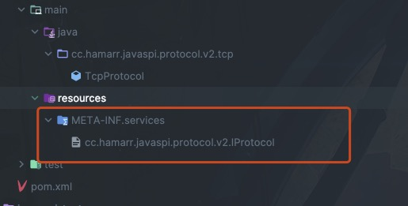
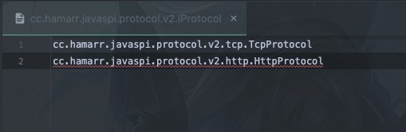
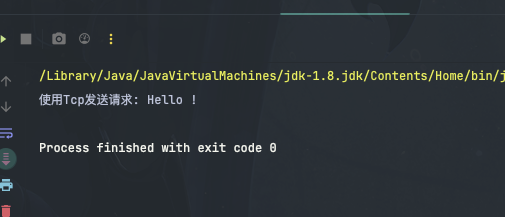

## Java SPI的使用

Java SPI的使用主要分为以下4个步骤:

1. 编写接口和实现类
2. 编写配置文件: 在Resources目录下创建META-INF/services文件夹，在文件夹下创建文本文件，文件的名字就是接口的全限定名, 文件内容则是实现类的全限定名，有多个用换行符隔开
3. 加载服务: ServiceLoader.load方法
4. 遍历服务：ServiceLoader实现了 `Iterable`接口，所以可以通过迭代器进行遍历

举个🌰

### 步骤一：编写接口和实现类

```java
import cc.hamarr.javaspi.protocol.v2.IProtocol;

public interface IProtocol {

    void sendRequest(String message);
}


```

实现类 : HttpProtocol, TcpProtocol

```java
package cc.hamarr.javaspi.protocol.v2.http;

import cc.hamarr.javaspi.protocol.v2.IProtocol;

public class HttpProtocol implements IProtocol {
    @Override
    public void sendRequest(String message) {
        System.out.println("使用Http发送请求: " + message);
    }
}

```

```java
package cc.hamarr.javaspi.protocol.v2.tcp;

import cc.hamarr.javaspi.protocol.v2.IProtocol;

public class TcpProtocol implements IProtocol {
    @Override
    public void sendRequest(String message) {
        System.out.println("使用Tcp发送请求: " + message);
    }
}

```

### 步骤二：编写配置文件





### 步骤三：加载服务

### 步骤四：使用服务

```java
package cc.hamarr.javaspi.test;

import cc.hamarr.javaspi.protocol.v2.IProtocol;

import java.util.Iterator;
import java.util.ServiceLoader;

public class SPITest {

    public static void main(String[] args) {
        ServiceLoader<IProtocol> loader = ServiceLoader.load(IProtocol.class);
        Iterator<IProtocol> iterator = loader.iterator();
        IProtocol service = null;
        if (iterator.hasNext()) {
            service = iterator.next();
        }

        if (service != null) {
            service.sendRequest("Hello !");
        }
    }
}

```

效果:

