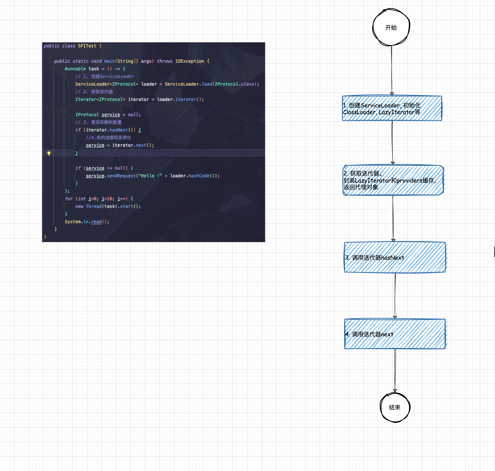
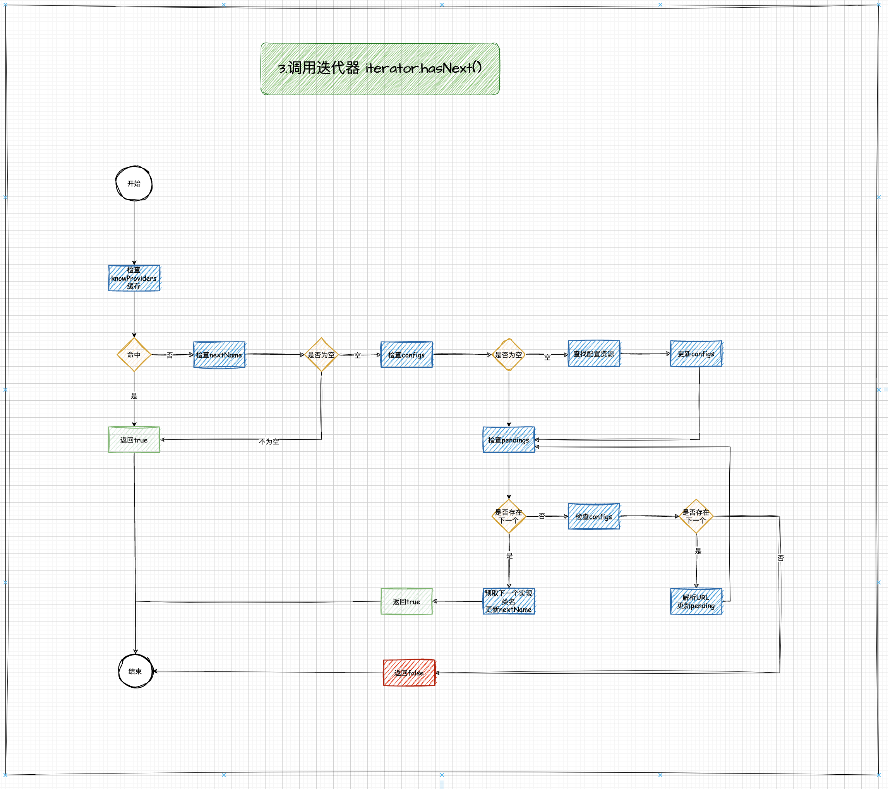
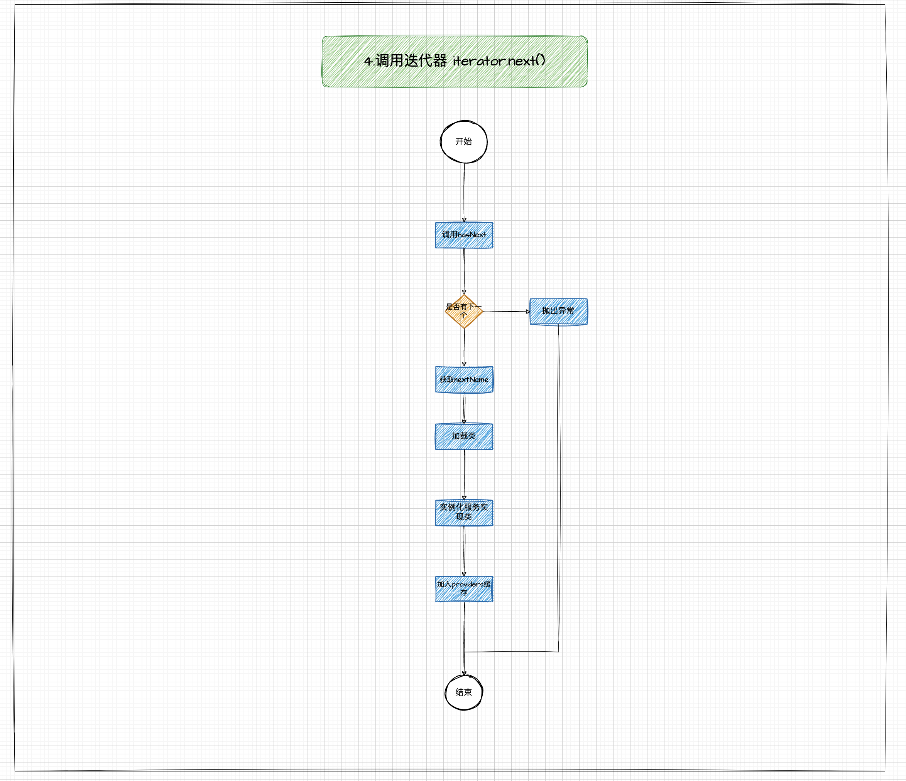

## 一个脑图

```mindmap
root((Java SPI))
    是什么
        JDK内置
        面向接口
            )依赖倒置(
            )里氏替换(
        基于约定和配置
    如何使用
        (1.编写接口和实现类)
        (2.配置文件<br/>META-INF/services)
        (3.方法调用<br/>ServiceLoader.load)
    核心流程
        (1.创建和初始化ServiceLoader)
        (2.扫描配置文件)
        (3.解析配置文件)
        (4.加载类并实例化)
```

## 一个流程图






